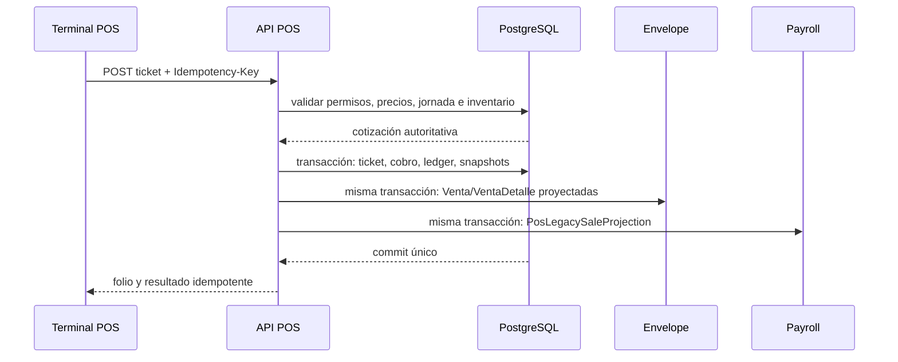
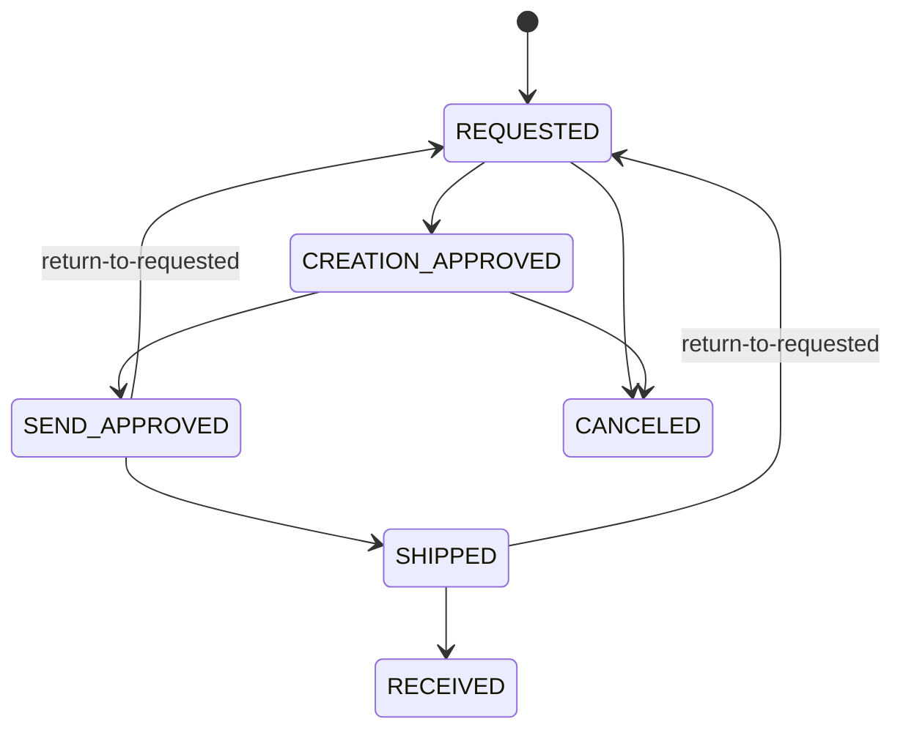
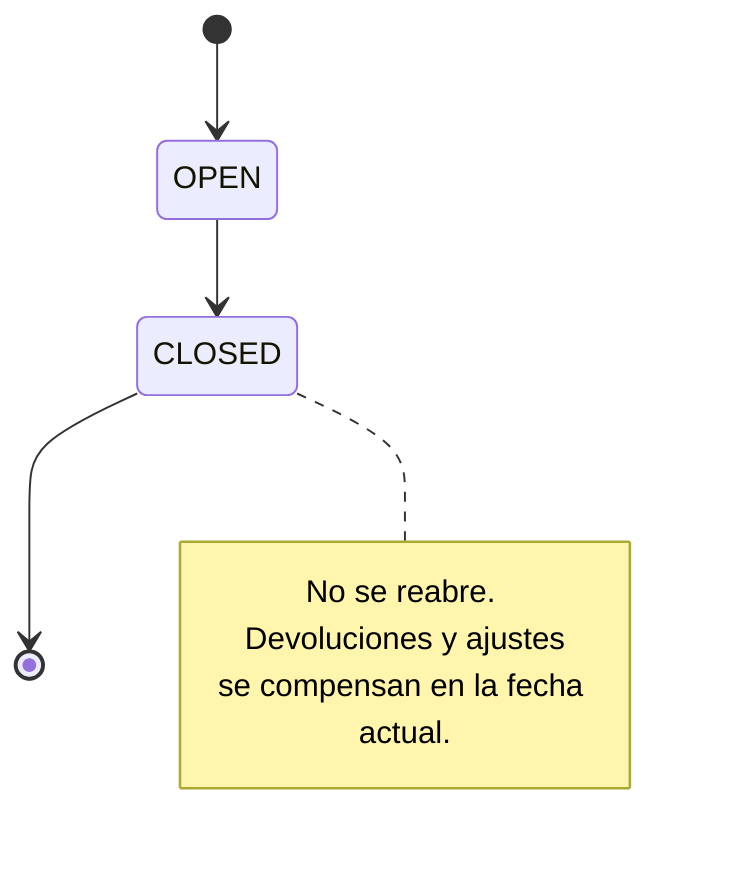
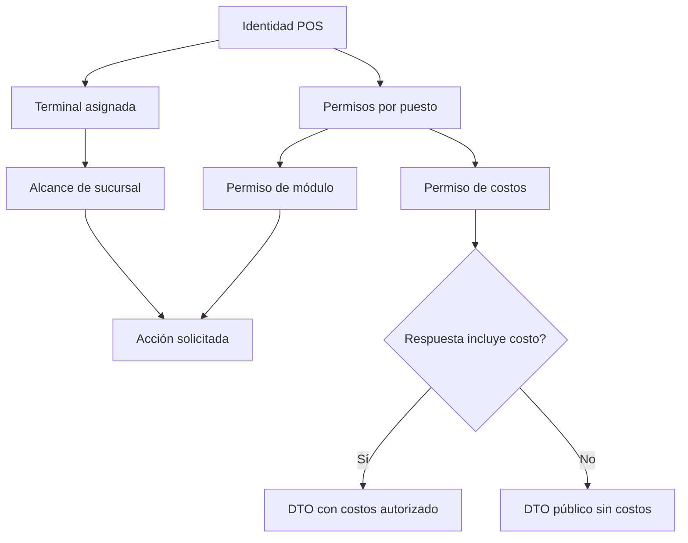

# Plan por fases: backend y bases de datos de `apps/pos`

> Documento de planeación creado el 2 de septiembre de 2026.
> Esta es la línea base funcional y técnica acordada para construir el backend, las bases de datos y la conexión real de `apps/pos`. Debe mantenerse como documento vivo: cada cambio solicitado por Producto debe registrar qué decisión reemplaza, por qué cambia y desde qué fase aplica.

## 1. Resumen y decisiones arquitectónicas

El POS se implementará como módulos dentro de `backend/api`, usando:

- PostgreSQL/Supabase como fuente central de verdad.
- SQLite en el proceso principal de Electron para caché, credenciales offline protegidas y cola durable.
- IndexedDB + Web Crypto como equivalente offline cuando se ejecute en navegador.
- Prisma y migraciones aditivas; nunca `db push` ni `migrate reset`.
- Integración vertical: cada fase incluye BD, API, tipos compartidos, cliente HTTP y sustitución gradual del mock correspondiente.
- El alcance cubre toda la operación actual del POS y `apps/pos/archivo.md`; excluye facturación SaaS de `My Account` y el placeholder `Websites`.

### Estado verificado y reutilización de datos existentes

| Existente                                                   | Decisión                                                                                                                                            |
| ----------------------------------------------------------- | --------------------------------------------------------------------------------------------------------------------------------------------------- |
| `Sucursal`                                                  | Reutilizar como sucursal canónica; agregar perfil POS para código, dirección, zona horaria y configuración.                                         |
| `Empleado`                                                  | Reutilizar como vendedor/operador; no duplicar empleados.                                                                                           |
| `Position`                                                  | Reutilizar como puesto/rol; agregar permisos POS independientes de Envelope y Payroll.                                                              |
| `Usuario`                                                   | Reutilizar para administradores existentes; operadores POS podrán autenticarse mediante credencial vinculada directamente al empleado.              |
| `MetodoPago`                                                | Reutilizar como catálogo base; agregar políticas POS para referencias y validaciones.                                                               |
| `Venta` y `VentaDetalle`                                    | Mantener como proyección compatible para Envelope y Payroll; no usarlas como ticket POS.                                                            |
| `CategoriaAtencion`, `SubcategoriaAtencion`, `RegistroCita` | Mantener como catálogo/historial legacy de atención; las citas futuras usarán modelos compartidos nuevos con vínculo opcional al registro atendido. |
| `Bank`                                                      | No reutilizar como catálogo de bancos de cobro: actualmente representa bancos de nómina de empleados.                                               |
| Tablas Payroll                                              | No modificar salvo por las ventas proyectadas que ya consume Payroll.                                                                               |

Los dos esquemas Prisma existentes están sincronizados. No hay credenciales locales para consultar filas reales de Supabase; antes del primer despliegue se ejecutará un inventario de datos de sólo lectura en development y luego, con autorización, en producción.

### Gobierno de fases y responsables

| Fase                                 | Estado                  | Responsable principal                | Criterio de salida                                                                        |
| ------------------------------------ | ----------------------- | ------------------------------------ | ----------------------------------------------------------------------------------------- |
| 0. Documento, contratos e inventario | Completada — 2026-09-02 | Backend/API                          | Contratos versionados, diagnóstico sólo lectura ejecutable y cero mutaciones productivas. |
| 1. Seguridad, terminales y auditoría | Completada — 2026-09-03 | Backend/API + Seguridad              | Credenciales protegidas, permisos efectivos y auditoría verificable.                      |
| 2. Catálogo, clientes y activos      | Completada — 2026-09-03 | Backend/API + POS                    | Catálogo histórico inmutable y costos redaccionados por servidor.                         |
| 3. Inventario y bodega               | Completada — 2026-09-03 | Backend/API + Operación de almacén   | Ledger consistente, reintentos idempotentes y doble aprobación distinta.                  |
| 4. Tickets y proyección financiera   | Completada — 2026-09-03 | Backend/API + POS + Envelope/Payroll | Totales, inventario y proyección legacy conciliados al centavo.                           |
| 5. Jornada, asistencia y caja        | Pendiente               | Backend/API + Operación de sucursal  | Una jornada por sucursal/fecha y cierre inmutable.                                        |
| 6. Offline y reconciliación          | Pendiente               | POS/Electron + Backend/API           | Reinicios y reintentos no pierden ni duplican operaciones.                                |
| 7. Reportes y retiro de mocks        | Pendiente               | Backend/API + POS                    | Módulos operativos consumen API o repositorio offline autorizado.                         |
| 8. Piloto y despliegue               | Pendiente               | Operación + Backend/API + Producto   | Piloto conciliado, rollback disponible y aprobación operativa.                            |

El responsable principal ejecuta la fase; los equipos indicados como colaboradores revisan sus límites. Ninguna fase posterior inicia mutaciones de datos por el mero hecho de que exista este plan.

### Diseño operativo de referencia

#### Ownership de tablas y datos

| Owner     | Entidades propias futuras                                                                  | Entidades que reutiliza                                     | Regla de integración                                      |
| --------- | ------------------------------------------------------------------------------------------ | ----------------------------------------------------------- | --------------------------------------------------------- |
| POS       | `Pos*`, catálogo operacional, inventario, bodega, tickets, jornada, autorizaciones, outbox | `Sucursal`, `Empleado`, `Position`, `Usuario`, `MetodoPago` | POS es la fuente canónica de su operación.                |
| Envelope  | `Venta`, `VentaDetalle`, historial de atención                                             | Proyección derivada de cobros POS                           | Nunca reconstruye el ticket POS ni altera su snapshot.    |
| Payroll   | Corridas, snapshots y movimientos de nómina                                                | Proyección de ventas POS                                    | Las corridas aprobadas no se recalculan retroactivamente. |
| Scheduler | Citas futuras y participantes                                                              | Clientes/citas compartidos de POS                           | `RegistroCita` se mantiene como historial legacy.         |

#### Límites transaccionales



Todo cambio que implique ticket, cobro, inventario o proyección compatible se confirma en una sola transacción PostgreSQL. Un reintento con la misma llave devuelve el resultado previamente confirmado; los ajustes posteriores generan eventos compensatorios, no edición de históricos.

#### Máquinas de estado





Los tickets y operaciones offline usarán, respectivamente, los estados documentados `COMPLETED/LAYAWAY/CANCELED/REFUNDED` y `PENDING/SYNCING/SYNCED/ERROR/CONFLICT`; los modelos definitivos de cada transición se crean en sus fases, nunca como estados implícitos de frontend.

#### Permisos y exposición de datos



La autorización se resuelve en servidor y se aplica antes de consultar/serializar. `INVENTORY_AUDIT` habilita comparativos de conteo; `REPORTS_COSTS` habilita DTOs de costo. Los permisos de POS no reutilizan ni conceden permisos de Envelope o Payroll.

## 2. Modelo, seguridad e interfaces públicas

### Modelo central nuevo

- Identidad y seguridad: `PosCredential`, `PosMasterCredential`, `PosTerminal`, `PosPermissionNode`, `PositionPosPermission`, `MasterAuthorization` y `AuditLog`.
  - `PosCredential` se vincula exactamente con un `Empleado` o un `Usuario`.
  - Alias normalizado único, PIN con hash, huella HMAC para evitar duplicados, contador de intentos, bloqueo temporal, versión y habilitación offline.
  - Se elimina por completo el código estático `2468`.
  - Las autorizaciones master serán tokens de un solo uso, con propósito, entidad, alcance, caducidad, actor y auditoría; nunca se guardará el PIN capturado.
- Catálogo compartido: `CatalogItem`, taxonomías, beneficios, disponibilidad por sucursal, historial de precios y activos.
  - Tipos `PRODUCT`, `SERVICE`, `SUPPLY` y `MACHINE`.
  - Tester será un uso autorizado de un producto, no otro producto duplicado.
  - Precios y costos usarán `Decimal`; la API transmitirá importes como strings con dos decimales.
  - Los tickets conservarán snapshots de nombre, SKU, taxonomía, IVA, mínimo, lista y costos autorizados.
- Clientes y agenda compartidos: `Customer`, `CustomerSource`, `CustomerPortfolioAssignment`, `Appointment` y participantes.
  - Teléfono normalizado único cuando exista.
  - Búsqueda sólo con criterio y paginación.
  - Cartera empresa/vendedor versionada y auditada.
  - `NO_APPOINTMENT` se conserva como evento sin horario; cortesías y próximas sesiones sí generan citas.
- Inventario: `InventoryLocation`, `InventoryBalance`, `InventoryMovement`, líneas, lotes de ajuste, conteos y líneas de auditoría.
  - Cada sucursal y la bodega matriz son ubicaciones.
  - Saldo, reservado y versión de concurrencia se actualizan transaccionalmente.
  - Se permite existencia negativa por venta sin stock, generando automáticamente producto adeudado.
- Bodega: proveedores, listas de precios versionadas, asignaciones por sucursal/cliente, solicitudes, líneas y eventos inmutables.
  - Flujos PRODUCT/TESTER/SUPPLY y compra a proveedor.
  - Dos aprobaciones de actores distintos.
  - Envío reserva/descuenta bodega; recepción de PRODUCT suma inventario vendible; TESTER/SUPPLY sólo registra consumo y costo.
- Ventas: `PosTicket`, líneas, vendedores, operaciones de pago, pagos, revisiones, cancelaciones/devoluciones, apartados, productos adeudados, entregas, paquetes/versiones, cortesías y vouchers.
  - UUID global idempotente y folio estable `KSR-{terminal}-{secuencia}` generado atómicamente en la BD local.
  - Ticket, líneas y cobros originales permanecen inmutables; correcciones generan revisiones o movimientos compensatorios.
  - Después del cierre no se reabre la jornada: devoluciones y ajustes se registran en la fecha actual.
- Operación diaria: `PosBusinessDay`, conteos, asistencias, gastos/tipos, configuración de ticket, campos de cliente y competencias.
  - Una jornada única por sucursal y fecha operativa en `America/Mexico_City`.
  - Conteo de apertura y cierre obligatorio, salvo omisión master auditada.
- Comunicación y sincronización: notificaciones, preferencias, lecturas por usuario, change feed/outbox, operaciones offline y eventos de sincronización.

### Contratos API

Mantener la envoltura `{ success, message, data }`, paginación explícita, fechas ISO UTC, `businessDate` local e importes decimales como strings.

Rutas principales:

- Autenticación: `POST /api/pos/auth/login`, `POST /api/pos/auth/verify`, `POST /api/pos/authorizations`.
- Terminal: registro, activación y cambio de sucursal bajo `/api/pos/terminals`.
- Datos iniciales/sync: `GET /api/pos/sync/bootstrap?cursor=...` y `POST /api/pos/sync/push`.
- Catálogo: `/catalog/items`, `/catalog/taxonomies`, `/catalog/prices`, `/suppliers` y `/price-lists`.
- Personas: `/customers/search`, `/customers`, `/employees/search`, `/roles` y `/permissions`.
- Inventario: `/inventory/balances`, `/inventory/movements`, `/inventory/adjustment-batches` y `/inventory/counts`.
- Bodega: `/warehouse/requests` con acciones `approve-creation`, `approve-send`, `receive`, `return-to-requested` y `cancel`.
- Venta: `POST /tickets/quote`, `POST /tickets`, `/tickets/:id/revisions`, `/tickets/:id/cancellations`, `/layaways/:id/payments` y `/owed-products/:id/deliveries`.
- Vouchers: emisión, impresión, reimpresión y canje sin duplicar la emisión.
- Jornada: apertura, conteo final y cierre bajo `/business-days`; asistencia y gastos en recursos separados.
- Consulta: `/dashboard`, `/reports/*`, `/exports/*` y `/notifications`.

Todas las mutaciones de ticket, pago, voucher, pedido y sincronización exigirán `Idempotency-Key`.

Los tipos POS saldrán de `apps/pos` hacia `packages/types/src/pos.ts`; `packages/api-client` expondrá un cliente tipado. Los DTO diferenciarán datos públicos, datos con costos y snapshots históricos para impedir filtraciones por serialización accidental.

### Proyección hacia Envelope y Payroll

- Cada operación de cobro POS generará una proyección en `Venta/VentaDetalle` dentro de la misma transacción.
- `PosLegacySaleProjection` relacionará cada operación, vendedor y `Venta` derivada.
- Los cobros se repartirán entre vendedores y métodos en centavos mediante algoritmo de mayor residuo, garantizando que filas, columnas y total coincidan exactamente.
- Apartados proyectan sólo el dinero efectivamente recibido; cada abono posterior genera su propia operación.
- Antes del cierre, una corrección puede reconstruir la proyección derivada.
- Después del cierre se generan proyecciones compensatorias en la fecha de la corrección; las corridas Payroll aprobadas permanecen congeladas.

## 3. Fases de implementación

### Fase 0 — Documento, contratos e inventario real

- [x] Registrar responsables, estado y criterio de salida por fase en este documento.
- [x] Documentar diagramas de transacciones, estados, permisos y ownership de tablas.
- [x] Crear script de diagnóstico de sólo lectura para contar sucursales, empleados, puestos, usuarios, métodos de pago y ventas, además de detectar relaciones incompletas.
- [x] Definir los esquemas Zod y DTO públicos antes de crear rutas.
- [x] Actualizar `CLAUDE.md` con la arquitectura aprobada.

**Criterio de cierre: cumplido.** El contrato técnico se revisó mediante schemas y pruebas unitarias; el diagnóstico se ejecuta con `pnpm --filter @cosmetics/api pos:diagnose` y sólo emite `SELECT`/`COUNT`. Esta fase no creó rutas POS, migraciones, seeds ni mutaciones productivas. La ejecución contra una base de datos development queda programada para la Fase 8, cuando exista el ambiente autorizado.

#### Entregables verificables

- DTOs públicos: `packages/types/src/pos.ts`, reexportados por `@cosmetics/types`. Los DTOs de costo extienden explícitamente los públicos para evitar filtraciones accidentales.
- Validación Zod: `backend/api/src/contracts/pos.contracts.ts`. Valida entrada y respuesta pública de paginación, alias/PIN, terminal, catálogo, búsqueda obligatoria, conteos, cotización, tickets y balances antes de que existan rutas. Las mutaciones reservadas validan desde ahora el header `Idempotency-Key`.
- Diagnóstico: `backend/api/scripts/diagnose-pos-data.ts`. Cuenta las seis entidades acordadas y separa asignaciones pendientes de referencias huérfanas y ventas legacy sin detalle.

### Fase 1 — Seguridad, terminales, permisos y auditoría

- [x] Crear la primera migración aditiva con credenciales POS, terminales, perfil de sucursal, árbol de permisos, autorizaciones y auditoría.
- [x] Sembrar únicamente nodos técnicos de permisos; empleados y puestos existentes reciben cero permisos automáticamente.
- [x] Implementar login online por alias/PIN, bloqueo por intentos, JWT POS, autorización master y registro seguro de terminal.
- [x] Implementar asignación fija de terminal a sucursal y cambio master auditado.
- [x] Conectar login, sesión, sucursales y `Employees` del frontend.

**Criterio de cierre: cumplido en repositorio.** En el flujo API no existe PIN operativo en texto plano, respuestas o logs; los códigos persistidos se protegen con bcrypt y una huella HMAC con pepper independiente. El middleware POS vuelve a resolver identidad, terminal, sucursal, versión de credencial y grants vigentes en cada petición; una ruta directa sin grant devuelve 403 y el login rechaza identidades con cero permisos. La aplicación real de la migración y la prueba HTTP contra PostgreSQL se conservan para una base desechable/development autorizada, nunca producción.

#### Entregables verificables

- Migración aditiva: `backend/api/prisma/migrations/20260902010000_add_pos_security_and_terminals/migration.sql`. Crea `PosCredential`, `PosMasterCredential`, `PosBranchProfile`, `PosTerminal`, `PosPermissionNode`, `PositionPosPermission`, `MasterAuthorization` y `AuditLog`; la restricción XOR obliga a vincular cada credencial exactamente con un empleado o usuario. Sólo inserta raíces y hojas técnicas de permisos, sin grants, credenciales, perfiles ni terminales operativas.
- Seguridad: `backend/api/src/services/pos-security.ts`, `pos-auth.ts` y `middlewares/pos-auth.middleware.ts`. Usa `POS_PIN_PEPPER`, `POS_JWT_SECRET`, bloqueo de 15 minutos después de cinco fallos y autorizaciones master de cinco minutos, ligadas a terminal y consumibles una sola vez.
- API: `backend/api/src/routes/pos.routes.ts` implementa login/sesión, autorizaciones, sucursales, terminales, cambio auditado de sucursal, perfiles POS, bootstrap de `Employees`, credenciales y permisos por puesto. El alta inicial de una credencial master y el registro de una terminal se protegen con el JWT compartido de un `SUPER_ADMIN`; una terminal nace `PENDING` y debe activarse explícitamente antes del primer login. El secreto sólo se entrega al registrar o rotar, y revocar la terminal invalida sus sesiones en la siguiente petición.
- Cliente e integración: `packages/api-client` expone `createPosApiClient`. En `VITE_POS_DATA_MODE=api`, Electron realiza el login mediante IPC desde el proceso principal usando `POS_TERMINAL_CODE` y `POS_TERMINAL_SECRET`; el secreto no entra al bundle ni a `localStorage`. El renderer conserva únicamente el JWT POS en `sessionStorage`, restaura la sesión con `/auth/me`, filtra módulos por permisos efectivos y carga empleados/puestos/credenciales desde `/access/bootstrap`.
- Pruebas: la suite unitaria cubre normalización, HMAC, secretos opacos y bcrypt. `backend/api/src/pos.integration.test.ts` cubre provisionamiento, activación/revocación de terminal, cero permisos por defecto, login, autorización master ligada a entidad, 403 y cambio de sucursal/revocación de sesión cuando `RUN_DATABASE_TESTS=true` sobre PostgreSQL desechable.

### Fase 2 — Catálogo, clientes, configuración y activos

- [x] Crear catálogo unificado, taxonomías, beneficios, sucursales visibles, historial de precios, fuentes de cliente y cartera.
- [x] Integrar imágenes mediante almacenamiento de objetos y metadatos en PostgreSQL; validar MIME, tamaño y fallback.
- [x] Implementar métodos de pago POS, configuración de ticket, campos obligatorios, cortesías, vouchers, proveedores, listas de precios, paquetes y competencias.
- [x] Aplicar validaciones de publicación, SKU único, precios, IVA, costos y soft delete.
- [x] Conectar Inventario/Catálogo digital, Customers, Suppliers, Deals y Settings.

**Criterio de cierre: cumplido en repositorio.** `CatalogItemPrice` conserva cada cambio de precio, costo e IVA como evento nuevo; la Fase 4 será la única que podrá materializar snapshots en tickets. Los DTO públicos no serializan `unitCost` ni los costos de listas, salvo para master o `REPORTS_COSTS`. `GET /customers/search` exige al menos dos caracteres y nunca permite un directorio completo por búsqueda vacía. La migración no se aplicó durante esta fase: primero debe ejecutarse sobre PostgreSQL desechable/development autorizado.

#### Entregables verificables

- Migración aditiva: `backend/api/prisma/migrations/20260903010000_add_pos_catalog_customers_assets/migration.sql`. Crea el catálogo, taxonomías, beneficios, visibilidad por sucursal, historial de precio, activos, clientes, fuentes y cartera; además de políticas POS de pago, configuración de ticket, campos requeridos, cortesías, vouchers, proveedores, listas versionadas, paquetes y competencias. No crea datos demostrativos ni modifica `Venta`/`VentaDetalle`.
- Seguridad y consistencia: SKU, folio de proveedor, teléfono normalizado y las claves configurables son únicos; los precios, costos e IVA pasan validación Zod y restricciones SQL. Los recursos con efectos históricos se desactivan mediante `deletedAt`, nunca se eliminan físicamente. Publicar un catálogo exige descripción y al menos un beneficio.
- API: `backend/api/src/routes/pos-catalog.routes.ts` publica recursos protegidos bajo `/api/pos`: catálogo/taxonomías/activos, clientes y fuentes, proveedores, métodos de pago, ticket, campos, cortesías, vouchers, listas de precios, paquetes y competencias. Aplica los grants POS del módulo correspondiente, el alcance de la terminal y la redacción de costos antes de serializar.
- Activos: `backend/api/src/services/pos-asset-storage.ts` almacena imágenes en el bucket Supabase `POS_ASSET_BUCKET` (por defecto `pos-assets`), acepta sólo JPEG/PNG/WebP/GIF y limita el archivo a 5 MB. El frontend conserva un fallback relativo cuando un artículo no tiene activo listo.
- Cliente e integración: `packages/api-client` añade operaciones tipadas para catálogo, búsqueda de clientes, fuentes, proveedores, vouchers y configuración de ticket. Al iniciar una sesión API, POS hidrata catálogo, proveedores, vouchers y configuración de impresión conforme a los permisos; `Customers` dispone del cliente de búsqueda paginada y con criterio obligatorio para su sustitución visual incremental.
- Pruebas: los contratos existentes validan publicación, búsqueda no vacía e importes exactos; la fase se comprobó con `prisma validate`, sincronía de ambos schemas, type-check API/POS y pruebas unitarias. Las pruebas HTTP contra PostgreSQL quedan para el ambiente efímero autorizado de la Fase 8.

### Fase 3 — Inventario, conteos y bodega matriz

- [x] Crear ubicaciones, saldos versionados, ledger inmutable, ajustes y conteos ciegos.
- [x] Implementar movimientos ADD/REMOVE/TRANSFER, devoluciones, demos, bajas y reversas.
- [x] Implementar solicitudes PRODUCT/TESTER/SUPPLY, resurtidos por proveedor, doble aprobación, envío, recepción, retorno y cancelación.
- [x] Crear notificaciones transaccionales de pedidos con lectura individual.
- [x] Conectar Inventario, Movimientos, Pedido sucursales y Almacén matriz.

**Criterio de cierre: cumplido en repositorio.** Los cambios de saldo, versión, ledger, estado de pedido, evento y notificación se confirman dentro de una transacción `Serializable`. Cada mutación operativa exige un `Idempotency-Key` UUID y conserva la respuesta confirmada para que un reintento equivalente no repita sus efectos; reutilizar la llave con otro actor, operación o payload devuelve conflicto. La segunda aprobación de bodega se rechaza cuando pertenece al mismo `PosCredential` que realizó la primera. La migración no se aplicó durante esta fase: primero debe validarse en PostgreSQL efímero/development autorizado.

#### Entregables verificables

- Migración aditiva: `backend/api/prisma/migrations/20260903020000_add_pos_inventory_warehouse/migration.sql`. Crea ubicaciones derivadas para las sucursales existentes y una bodega matriz, saldos con versión, movimientos/líneas, lotes de ajuste, conteos/líneas, solicitudes/eventos de bodega, notificaciones/lecturas e idempotencia durable. No inserta productos ni movimientos mock, no modifica `Venta`/`VentaDetalle` y protege con triggers las líneas del ledger, las líneas de conteo y los eventos append-only.
- Consistencia de inventario: `backend/api/src/services/pos-inventory.ts` aplica deltas y reservas mediante actualizaciones atómicas, incrementa `version`, genera folios con secuencias PostgreSQL, conserva snapshots de costo y crea reversas compensatorias sin editar las líneas originales. Los saldos de sucursal pueden quedar negativos para los flujos posteriores de venta; los envíos de matriz exigen existencia no reservada suficiente.
- API: `backend/api/src/routes/pos-inventory.routes.ts` publica ubicaciones, saldos, ledger paginado, lotes pendientes/editables, aprobación/cancelación/reversa, conteos y el flujo completo de `/warehouse/requests`. `approve-send` registra las dos transiciones y descuenta matriz en el mismo commit; recibir `PRODUCT` suma inventario vendible, mientras `TESTER`/`SUPPLY` sólo confirma consumo. Un retorno restaura matriz mediante un movimiento `REVERSAL` y conserva el folio y los eventos históricos.
- Privacidad y alcance: el backend limita ubicaciones y solicitudes a la sucursal fija de la terminal salvo `WAREHOUSE_MANAGE`; los conteos ordinarios sólo devuelven capturado y coincidencia. Esperado, diferencia y notas requieren `INVENTORY_AUDIT`, y ningún costo se serializa sin master o `REPORTS_COSTS`.
- Notificaciones: cada cambio relevante de pedido crea una `PosNotification` dentro de la misma transacción. La consulta filtra sucursal y permiso de audiencia; `PosNotificationRead` conserva lectura independiente por credencial y no comparte estado entre operadores.
- Cliente e integración: `packages/types` y `packages/api-client` exponen DTOs y operaciones tipadas para inventario, conteos, pedidos y notificaciones. En modo API, `apps/pos` hidrata ubicaciones, saldos, ledger, lotes, bodega y bandeja; altas, aprobaciones, recepciones, retornos, cancelaciones y conteos llaman al backend. El adaptador `apps/pos/src/renderer/src/lib/pos-inventory-api.ts` mantiene compatibles las vistas existentes sin introducir costos redaccionados.
- Verificación local: schemas Prisma sincronizados y válidos, 34 pruebas unitarias en verde, type-check de types/API/client/POS, build del API y build Vite/Electron del POS. La prueba de migración, concurrencia y HTTP sobre PostgreSQL queda para el ambiente efímero autorizado porque este workspace no dispone de servidor ni credenciales de base de datos.

### Fase 4 — Tickets, checkout y proyección financiera

- [x] Implementar cotización autoritativa del carrito: mínimo combinado, SPARE, descuentos, paquetes, IVA y autorización master.
- [x] Crear ticket, cliente, vendedores, citas, cortesías, pagos, inventario y proyección legacy en una sola transacción.
- [x] Implementar múltiples métodos de pago, pendiente, apartado, abonos, productos adeudados y entregas.
- [x] Implementar vouchers posteriores al ticket, impresión y reimpresión sin duplicación.
- [x] Implementar revisiones, cancelaciones y devoluciones como historial append-only.
- [x] Conectar Sale, Checkout, Receipts, Mis ventas y expedientes de cliente.

**Criterio de cierre: cumplido en repositorio.** La cotización autoritativa fija en centavos el total que Checkout muestra y que el ticket conserva para impresión. El mismo commit `Serializable` crea el ticket, snapshots, cliente/cartera cuando corresponde, vendedores, citas, cortesías, cobros, apartado, movimiento de inventario, adeudos y proyecciones `Venta/VentaDetalle`; los abonos y reembolsos generan proyecciones adicionales exactamente por el dinero recibido o compensado. Toda mutación financiera exige `Idempotency-Key` UUID. La migración y las pruebas HTTP/transaccionales no se ejecutaron contra una base real durante esta fase: permanecen como puerta obligatoria de la Fase 8 sobre PostgreSQL efímero/development autorizado.

#### Entregables verificables

- Migración aditiva: `backend/api/prisma/migrations/20260903030000_add_pos_tickets_checkout_projection/migration.sql`. Crea tickets y líneas con snapshots, vendedores, operaciones/pagos, apartados, adeudos/entregas, citas/cortesías, eventos, vouchers e impresión, además de secuencias de folio y `PosLegacySaleProjection`. Los históricos financieros y las ventas legacy proyectadas se protegen con triggers append-only; no se insertan tickets, pagos ni datos mock.
- Motor financiero: `backend/api/src/services/pos-tickets.ts` trabaja en centavos, reparte residuos determinísticamente, calcula IVA incluido, limita el descuento al SPARE y valida paquetes completos contra precio y vigencia publicados. Una venta bajo el mínimo combinado requiere autorización master de un solo uso; un paquete publicado usa su precio autorizado como piso y no admite descuento adicional bajo ese importe.
- Atomicidad y compatibilidad: crear ticket usa el ledger real de la Fase 3 y proyecta cada cobro entre vendedores y métodos en `Venta/VentaDetalle` dentro de la misma transacción. Los productos entregados sin existencia permiten saldo negativo y generan adeudo ya comprometido; los artículos de apartado aún no entregados conservan el compromiso sin descontar y lo hacen una sola vez al entregarse. Cancelaciones y devoluciones suman inventario y crean cobros/proyecciones negativos sin editar originales.
- API y seguridad: `backend/api/src/routes/pos-ticket.routes.ts` publica cotización, tickets paginados, vendedores de venta, abonos, entregas, revisiones, cancelaciones, vouchers e impresión/reimpresión. Las rutas aplican sesión, permiso y sucursal de terminal en servidor; revisiones y cancelaciones consumen autorización master ligada al ticket.
- Contratos e integración: `packages/types/src/pos.ts` y `packages/api-client/src/index.ts` incluyen los DTO y métodos tipados de la fase. En `VITE_POS_DATA_MODE=api`, `apps/pos` carga catálogo, paquetes, vendedores, formas de pago, tickets, citas, apartados, adeudos, clientes y vouchers; Checkout busca clientes paginados, usa el total cotizado por servidor y envía la operación real. Receipts, Mis ventas y expedientes se derivan de los tickets canónicos devueltos por la API.
- Vouchers e historial: la emisión conserva snapshots y la restricción ticket/plantilla evita duplicarla; cada impresión o reimpresión agrega un evento con número de copia. Las revisiones conservan el cambio solicitado como snapshot append-only y las cancelaciones/devoluciones agregan sus compensaciones y decisiones de producto sin borrar el ticket.
- Verificación local: ambos schemas Prisma están sincronizados y son válidos; type-check de types/API/client/POS, lint del API, 39 pruebas unitarias, build del API y build Vite/Electron del POS terminaron correctamente. La validación mostró únicamente los avisos preexistentes de configuración Prisma deprecada y tamaño de bundle Vite.

### Fase 5 — Jornada, asistencia, caja y operación ejecutiva

- [ ] Implementar jornada única por sucursal/día, apertura, conteo final y cierre.
- [ ] Limitar las respuestas de conteo ciego a correcto/incorrecto; diferencias, notas y costos se filtran en servidor.
- [ ] Cerrar asistencias abiertas al terminar la jornada.
- [ ] Implementar tipos de gasto, gastos, anulaciones y autorización.
- [ ] Conectar Clock In, Cash Manager, Dashboard, X-Report y Close day.
- [ ] Bloquear edición retroactiva después del cierre y usar compensaciones actuales.

**Criterio de cierre:** dos terminales no pueden abrir o cerrar dos jornadas para la misma sucursal y fecha.

### Fase 6 — Operación offline y reconciliación

- [ ] Crear repositorio local SQLite en el proceso principal de Electron con IPC limitado; no exponer Node ni acceso directo al archivo desde el renderer.
- [ ] Cifrar payloads con AES-GCM y proteger la clave del dispositivo con el almacén seguro de Electron.
- [ ] En navegador usar IndexedDB y una clave Web Crypto no exportable.
- [ ] Cachear catálogo, permisos, sucursal, terminal y grants offline firmados y con caducidad.
- [ ] Permitir offline únicamente login previamente habilitado, conteos, venta, abonos, citas, cortesías, vouchers y cierre local.
- [ ] Mantener catálogo, permisos, configuración, bodega y ajustes administrativos exclusivamente online.
- [ ] Sincronizar por orden terminal/secuencia; estados `PENDING`, `SYNCING`, `SYNCED`, `ERROR` y `CONFLICT`.
- [ ] Revalidar en servidor permisos, mínimos, credenciales, catálogo e inventario; un conflicto nunca borra la operación local.

**Criterio de cierre:** cerrar Electron o perder red durante una venta no pierde ni duplica tickets, pagos o movimientos dependientes.

### Fase 7 — Notificaciones, reportes, exportaciones y retiro de mocks

- [ ] Implementar preferencias, outbox y lectura por usuario.
- [ ] Construir Dashboard, Receipts, X-Report y reportes desde consultas paginadas con alcance de sucursal.
- [ ] Obtener datasets autorizados del backend para exportaciones; el frontend podrá generar XLSX/PDF con las librerías actuales.
- [ ] Aplicar protección de costos en consultas, detalles, notificaciones y exportaciones.
- [ ] Sustituir los últimos estados mock y conservar `mock-data.ts` únicamente como fixture de pruebas.
- [ ] No migrar datos demostrativos a ninguna BD operativa.

**Criterio de cierre:** todos los módulos operativos consumen API o repositorio offline y el modo API no depende de `localStorage`.

### Fase 8 — Migración, piloto y despliegue

- [ ] Validar cada migración sobre PostgreSQL desechable y después en Supabase development.
- [ ] Ejecutar diagnóstico de datos existentes, crear perfiles faltantes de sucursal y configurar explícitamente master, permisos y terminal piloto.
- [ ] Ejecutar operación paralela en una sucursal: aperturas, ventas, apartados, cancelaciones, inventario, cierre, Envelope y preview Payroll.
- [ ] Comparar totales y movimientos antes de habilitar más terminales.
- [ ] Promover backend mediante el workflow protegido; respaldar/PITR antes de migrar producción.
- [ ] Mantener rollback por feature flag `VITE_POS_DATA_MODE=mock|api` hasta aprobar el piloto, sin intentar convertir datos mock.

**Criterio de cierre:** conciliación sin diferencias, sincronización offline recuperable, observabilidad estable y aprobación operativa.

## 4. Pruebas y criterios de aceptación

- Unitarias: dinero/IVA, mínimo combinado, SPARE, descuentos, prorrateo de vendedores/métodos, folios, estados y permisos padre/hijo.
- Integración PostgreSQL: migraciones desde el esquema actual, concurrencia de inventario, transacciones de checkout, proyección legacy, doble aprobación, cierre y compensaciones.
- HTTP: autenticación, rate limiting, 401/403, paginación, búsqueda no vacía, idempotencia, redacción de costos y validación Zod.
- Offline: reinicio antes/después de confirmar, lote duplicado, operaciones fuera de orden, grant vencido, catálogo desactualizado, inventario insuficiente y reintentos.
- E2E en navegador y Electron: login, apertura, venta, apartado/abono, cita, voucher, impresión, pedido, recepción, gasto y cierre.
- Seguridad: ningún PIN, hash, costo no autorizado, payload cifrado o secreto master aparece en respuestas/logs.
- Compatibilidad: ventas POS visibles una sola vez en Envelope y Payroll; una cancelación posterior al cierre genera compensación sin alterar snapshots aprobados.
- Calidad obligatoria: sincronía de ambos schemas Prisma, `prisma validate`, type-check/build/test del API, type-check/Vite build del POS e integración sobre PostgreSQL efímero.

## 5. Supuestos y límites fijados

- PostgreSQL seguirá siendo la única BD central; SQLite/IndexedDB sólo serán almacenamiento local de terminal.
- Una jornada pertenece a una sucursal y fecha, no a cada terminal.
- Clientes y citas serán modelos compartidos preparados para Scheduler.
- Las funciones SaaS de tarjetas de suscripción, cobros mensuales, facturas de plataforma y `Websites` quedan fuera.
- No se consultará ni modificará producción sin autorización explícita.
- Empleados, puestos o sucursales existentes no recibirán credenciales ni permisos POS automáticamente.
- Los documentos históricos y movimientos no se borrarán; sólo borradores sin efectos podrán ocultarse mediante soft delete.

## 6. Registro de decisiones de Producto

Esta sección conserva las preguntas planteadas durante la planeación, todas las alternativas consideradas y la respuesta que definió esta línea base. Si el PO redirige la funcionalidad, no se debe borrar la decisión anterior: se agregará una nueva entrada en el historial de cambios indicando qué respuesta fue sustituida.

### Decisión 1 — Alcance del backend

**Pregunta:** ¿Qué significa “todo el backend” para las funciones visibles hoy en el mock del POS pero no detalladas en `archivo.md`?

Opciones consideradas:

1. **Operación completa — elegida.** Incluye todos los flujos operativos actuales y `archivo.md`, pero excluye facturación SaaS de `My Account` y `Websites`, que no son operación POS.
2. **Todo literal del mock.** Incluye también tarjetas, cobro mensual por ubicación, historial de facturas y el placeholder `Websites`.
3. **Sólo `archivo.md`.** Implementa únicamente lo consolidado en `archivo.md` y deja fuera funciones adicionales del mock.

**Respuesta acordada:** Operación completa.

**Impacto:** el roadmap sí incluye catálogo, clientes, ventas, apartados, inventario, bodega, proveedores, paquetes, competencias, vouchers, caja, jornadas, asistencias, permisos, notificaciones y reportes. No incluye el backend comercial de suscripciones de la plataforma ni `Websites`.

### Decisión 2 — Integración con ventas existentes

**Pregunta:** ¿Cómo deben convivir los tickets POS con las ventas existentes de Envelope y los cálculos de Payroll?

Opciones consideradas:

1. **Proyección automática — elegida.** El ticket POS es la fuente de verdad y genera en la misma transacción registros compatibles en `Venta/VentaDetalle` para no romper Envelope ni Payroll.
2. **Migrar consumidores.** Envelope y Payroll se modifican para leer directamente las nuevas tablas POS, con mayor alcance y riesgo de regresión.
3. **POS aislado.** Las ventas POS no alimentan por ahora Envelope ni Payroll, evitando cambios cruzados pero duplicando la operación.

**Respuesta acordada:** Proyección automática.

**Impacto:** `PosTicket` será la fuente canónica detallada; `Venta/VentaDetalle` permanecerán como proyección compatible y conciliable.

### Decisión 3 — Nombre del documento

**Pregunta:** ¿Qué nombre prefieres para el archivo de plan en la raíz?

Opciones consideradas:

1. **`PLAN_BACKEND_POS.md` — elegida.** Nombre explícito, estable y fácil de encontrar en sesiones posteriores.
2. **`POS_BACKEND_ROADMAP.md`.** Enfatiza que será una hoja de ruta incremental.
3. **`PLAN_POS.md`.** Nombre corto si el archivo cubre también integración futura de frontend.

**Respuesta acordada:** `PLAN_BACKEND_POS.md`.

### Decisión 4 — Profundidad de la integración

**Pregunta:** ¿El roadmap debe terminar sólo con API/BD listas o también con el POS reemplazando gradualmente sus mocks para validar los flujos completos?

Opciones consideradas:

1. **Backend + conexión POS — elegida.** Cada fase entrega modelos, API y el cableado mínimo del frontend/Electron, incluida la BD offline, para probar el flujo real.
2. **Sólo backend y BD.** Se dejan contratos y pruebas HTTP completos, pero el frontend continúa usando mocks hasta otro roadmap.
3. **Backend primero, conexión final.** Se construye toda la API antes y se integra el frontend completo en una sola fase posterior.

**Respuesta acordada:** Backend + conexión POS.

**Impacto:** las fases son cortes verticales y comprobables; no se acumulará toda la integración frontend para el final.

### Decisión 5 — Alcance de la jornada

**Pregunta:** ¿Cómo debe definirse la jornada de apertura/conteo/cierre cuando una sucursal tenga más de una terminal?

Opciones consideradas:

1. **Una por sucursal/día — elegida.** Todas las terminales comparten la misma apertura y cierre operativo de la sucursal, evitando cortes duplicados.
2. **Una por terminal/día.** Cada caja abre, cuenta y corta de forma independiente; los reportes de sucursal consolidan terminales.
3. **Una por turno.** Una terminal puede abrir y cerrar varias jornadas por día, con complejidad adicional de turnos.

**Respuesta acordada:** Una jornada por sucursal y día.

**Impacto:** habrá una restricción única por sucursal/fecha operativa y control de concurrencia al abrir y cerrar.

### Decisión 6 — Tratamiento de los datos mock

**Pregunta:** ¿Qué debe ocurrir con los productos, clientes, tickets y demás datos demostrativos actuales al conectar la persistencia real?

Opciones consideradas:

1. **No migrarlos — elegida.** Sólo se siembran catálogos técnicos y permisos; los mocks quedan disponibles para fixtures de pruebas, nunca como datos reales.
2. **Cargar en desarrollo.** Se convierten en seed opcional exclusivo de BD de desarrollo para conservar la demo.
3. **Importar como iniciales.** Se prepara una migración de los mocks como datos operativos, lo que exige validarlos antes de cualquier ambiente real.

**Respuesta acordada:** No migrar los mocks.

**Impacto:** ningún producto, cliente, ticket o movimiento demostrativo se insertará en Supabase; `mock-data.ts` sólo podrá sobrevivir como fixture de pruebas.

### Decisión 7 — Correcciones después del cierre

**Pregunta:** ¿Cómo deben tratarse ediciones o cancelaciones de tickets después de cerrar la jornada?

Opciones consideradas:

1. **Compensar sin reabrir — elegida.** El día cerrado queda congelado; cualquier corrección genera revisión, devolución y ajuste en la fecha actual con autorización y auditoría.
2. **Reabrir con master.** Un master puede reabrir el día, recalcular corte e históricos y volver a cerrarlo.
3. **Editar retroactivo.** Se cambia directamente el día original, opción simple pero débil para auditoría y nómina.

**Respuesta acordada:** Compensar sin reabrir.

**Impacto:** los cortes y snapshots históricos son inmutables; devoluciones o correcciones posteriores aparecen como operaciones compensatorias actuales.

### Decisión 8 — Mutaciones permitidas sin internet

**Pregunta:** ¿Qué debe poder modificarse mientras la terminal está sin internet?

Opciones consideradas:

1. **Operación de caja — elegida.** Login habilitado, conteos, venta, pagos de apartado, citas/cortesías/vouchers y cierre local; catálogos, permisos, bodega y configuración quedan sólo online.
2. **Sólo venta.** Únicamente tickets y cobros se encolan; conteos, cierre y demás funciones requieren conexión.
3. **Todo el POS.** También permite editar catálogos, permisos, inventario y bodega offline, con conflictos mucho más complejos.

**Respuesta acordada:** Operación de caja.

**Impacto:** el motor offline no necesita reconciliar cambios administrativos concurrentes; sí debe mantener atómicamente todos los efectos dependientes de una venta.

### Decisión 9 — Clientes y citas compartidos

**Pregunta:** ¿Clientes y citas creados por POS deben diseñarse desde ahora como fuente común para la futura integración de Scheduler?

Opciones consideradas:

1. **Modelo compartido — elegida.** POS crea entidades canónicas reutilizables por Scheduler y mantiene `RegistroCita` sólo como historial de atención legacy.
2. **Tablas exclusivas POS.** Aísla el desarrollo actual, pero exigirá unificación y migración de clientes/citas más adelante.
3. **Sólo clientes comunes.** Comparte el directorio de clientes, pero las citas permanecen separadas por aplicación.

**Respuesta acordada:** Modelo compartido.

**Impacto:** los nombres y relaciones de clientes/citas no llevarán ownership exclusivo de POS; Scheduler deberá adoptar esas entidades cuando llegue su fase de persistencia.

## 7. Plantilla para futuros cambios de dirección

Agregar una entrada nueva por cada redirección del PO:

```md
### Cambio N — Título breve

- Fecha:
- Solicitado por:
- Decisión anterior afectada:
- Contexto nuevo:
- Nueva decisión:
- Fases/modelos/endpoints afectados:
- Datos o migraciones requeridos:
- Compatibilidad y riesgos:
- Criterio de aceptación actualizado:
```

No reescribir silenciosamente este registro: conservar siempre la trazabilidad entre la intención inicial y el alcance vigente.
