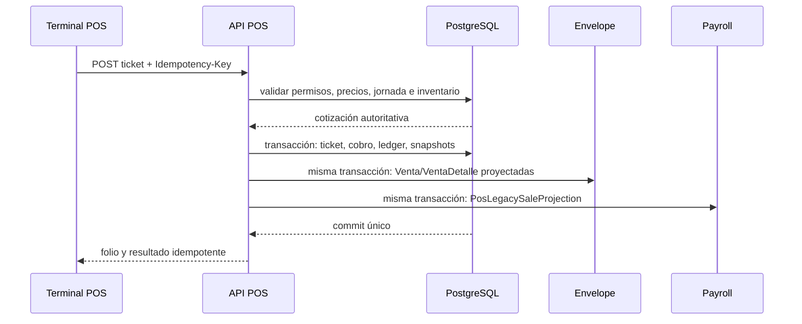
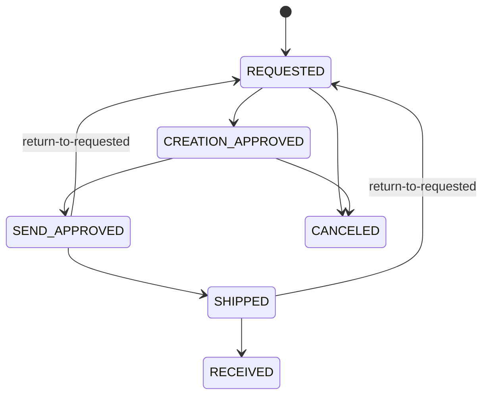
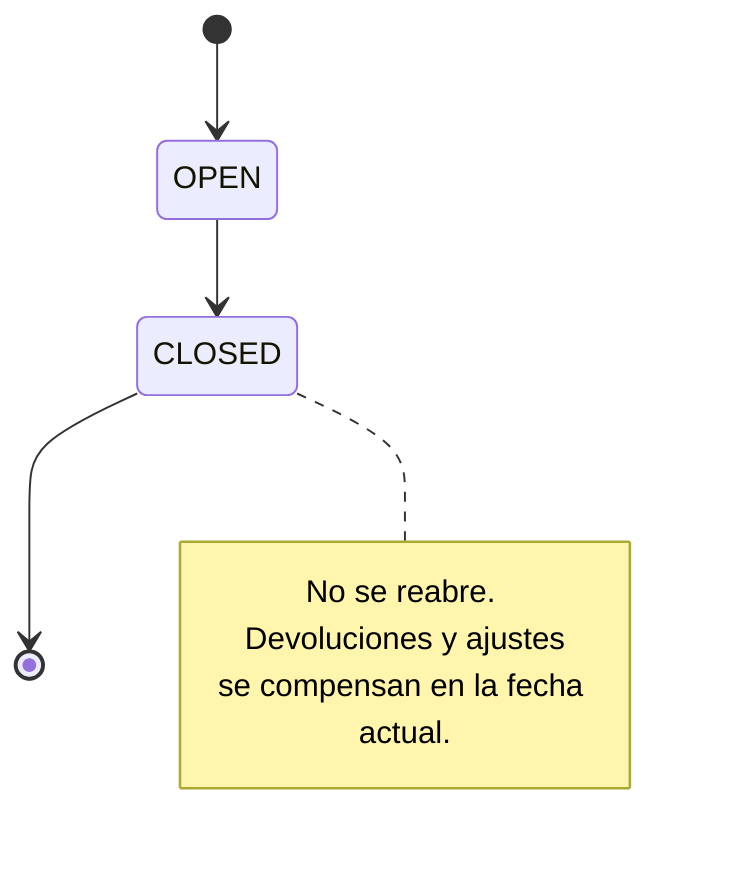
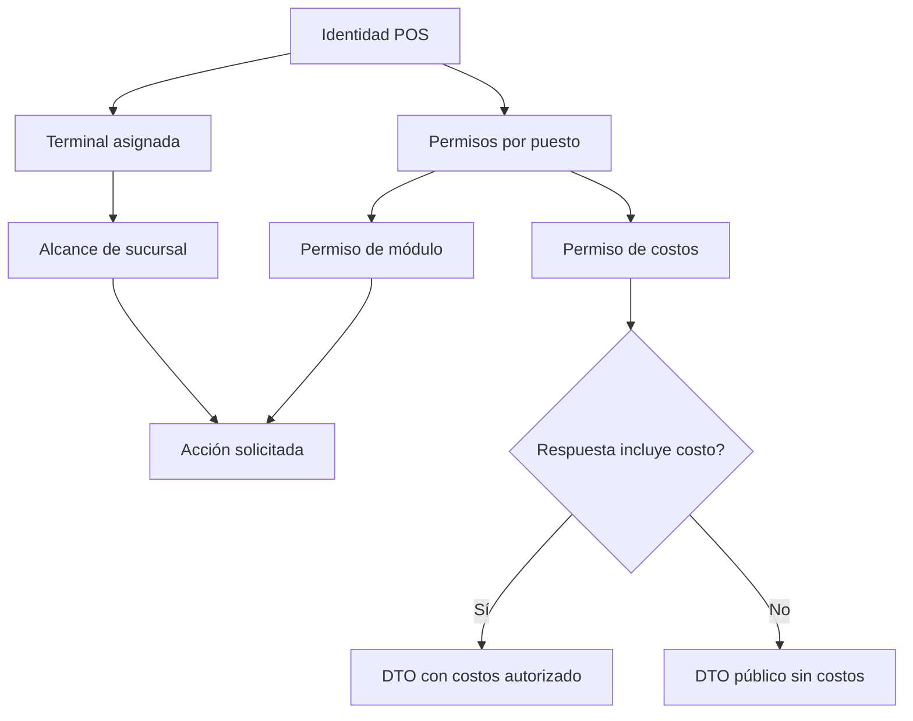

# Plan por fases: backend y bases de datos de `apps/pos`

> Documento de planeación creado el 2 de septiembre de 2026.
> Esta es la línea base funcional y técnica acordada para construir el backend, las bases de datos y la conexión real de `apps/pos`. Debe mantenerse como documento vivo: cada cambio solicitado por Producto debe registrar qué decisión reemplaza, por qué cambia y desde qué fase aplica.

## 1. Resumen y decisiones arquitectónicas

El POS se implementará como módulos dentro de `backend/api`, usando:

- PostgreSQL/Supabase como fuente central de verdad.
- SQLite en el proceso principal de Electron para caché, credenciales offline protegidas y cola durable.
- IndexedDB + Web Crypto como equivalente offline cuando se ejecute en navegador.
- Prisma y migraciones aditivas; nunca `db push` ni `migrate reset`.
- Integración vertical: cada fase incluye BD, API, tipos compartidos, cliente HTTP y sustitución gradual del mock correspondiente.
- El alcance cubre toda la operación actual del POS y `apps/pos/archivo.md`; excluye facturación SaaS de `My Account` y el placeholder `Websites`.

### Estado verificado y reutilización de datos existentes

| Existente                                                   | Decisión                                                                                                                                            |
| ----------------------------------------------------------- | --------------------------------------------------------------------------------------------------------------------------------------------------- |
| `Sucursal`                                                  | Reutilizar como sucursal canónica; agregar perfil POS para código, dirección, zona horaria y configuración.                                         |
| `Empleado`                                                  | Reutilizar como vendedor/operador; no duplicar empleados.                                                                                           |
| `Position`                                                  | Reutilizar como puesto/rol; agregar permisos POS independientes de Envelope y Payroll.                                                              |
| `Usuario`                                                   | Reutilizar para administradores existentes; operadores POS podrán autenticarse mediante credencial vinculada directamente al empleado.              |
| `MetodoPago`                                                | Reutilizar como catálogo base; agregar políticas POS para referencias y validaciones.                                                               |
| `Venta` y `VentaDetalle`                                    | Mantener como proyección compatible para Envelope y Payroll; no usarlas como ticket POS.                                                            |
| `CategoriaAtencion`, `SubcategoriaAtencion`, `RegistroCita` | Mantener como catálogo/historial legacy de atención; las citas futuras usarán modelos compartidos nuevos con vínculo opcional al registro atendido. |
| `Bank`                                                      | No reutilizar como catálogo de bancos de cobro: actualmente representa bancos de nómina de empleados.                                               |
| Tablas Payroll                                              | No modificar salvo por las ventas proyectadas que ya consume Payroll.                                                                               |

Los dos esquemas Prisma existentes están sincronizados. No hay credenciales locales para consultar filas reales de Supabase; antes del primer despliegue se ejecutará un inventario de datos de sólo lectura en development y luego, con autorización, en producción.

### Gobierno de fases y responsables

| Fase                                 | Estado                                             | Responsable principal                  | Criterio de salida                                                                         |
| ------------------------------------ | -------------------------------------------------- | -------------------------------------- | ------------------------------------------------------------------------------------------ |
| 0. Documento, contratos e inventario | Completada — 2026-09-02                            | Backend/API                            | Contratos versionados, diagnóstico sólo lectura ejecutable y cero mutaciones productivas.  |
| 1. Seguridad, terminales y auditoría | Completada — 2026-09-03                            | Backend/API + Seguridad                | Credenciales protegidas, permisos efectivos y auditoría verificable.                       |
| 2. Catálogo, clientes y activos      | Completada — 2026-09-03                            | Backend/API + POS                      | Catálogo histórico inmutable y costos redaccionados por servidor.                          |
| 3. Inventario y bodega               | Completada — 2026-09-03                            | Backend/API + Operación de almacén     | Ledger consistente, reintentos idempotentes y doble aprobación distinta.                   |
| 4. Tickets y proyección financiera   | Completada — 2026-09-03                            | Backend/API + POS + Envelope/Payroll   | Totales, inventario y proyección legacy conciliados al centavo.                            |
| 5. Jornada, asistencia y caja        | Completada — 2026-09-03                            | Backend/API + Operación de sucursal    | Una jornada por sucursal/fecha y cierre inmutable.                                         |
| 6. Offline y reconciliación          | Completada — 2026-09-03                            | POS/Electron + Backend/API             | Reinicios y reintentos no pierden ni duplican operaciones.                                 |
| 7. Reportes y retiro de mocks        | Completada — 2026-09-03                            | Backend/API + POS                      | Módulos operativos consumen API o repositorio offline autorizado.                          |
| 8. Piloto y despliegue               | Implementada en repositorio — activación pendiente | Operación + Backend/API + Producto     | Piloto conciliado, rollback disponible y aprobación operativa.                             |
| 9. Autorización y alcance ampliados  | Completada — 2026-09-03                            | Backend/API + Seguridad + POS          | Cada destino, sucursal y acción nueva se autoriza en servidor y queda auditada.            |
| 10. Membresías                       | Completada — 2026-09-04                            | Backend/API + POS + Producto           | Tarjetones, saldos y cierres comerciales son transaccionales, idempotentes y conciliables. |
| 11. Agenda CRM                       | Completada — 2026-09-04                            | Backend/API + Agenda + POS             | Cliente y reservación tienen IDs externos; conflictos y webhooks se reconcilian.           |
| 12. Reglas comerciales ampliadas     | Completada — 2026-09-04                            | Backend/API + POS + Finanzas           | Pagos, cortesías, cartera y participantes conservan validación y snapshots históricos.     |
| 13. Consultas y reportes ampliados   | Completada en repositorio — 2026-09-04             | Backend/API + POS                      | Indicadores, filtros y exportaciones coinciden para todo el alcance autorizado.            |
| 14. Offline y segundo piloto         | Pendiente                                          | POS/Electron + Backend/API + Operación | Las capacidades nuevas sobreviven reintentos y pasan conciliación integral.                |

El responsable principal ejecuta la fase; los equipos indicados como colaboradores revisan sus límites. Ninguna fase posterior inicia mutaciones de datos por el mero hecho de que exista este plan.

### Diseño operativo de referencia

#### Ownership de tablas y datos

| Owner     | Entidades propias futuras                                                                  | Entidades que reutiliza                                     | Regla de integración                                      |
| --------- | ------------------------------------------------------------------------------------------ | ----------------------------------------------------------- | --------------------------------------------------------- |
| POS       | `Pos*`, catálogo operacional, inventario, bodega, tickets, jornada, autorizaciones, outbox | `Sucursal`, `Empleado`, `Position`, `Usuario`, `MetodoPago` | POS es la fuente canónica de su operación.                |
| Envelope  | `Venta`, `VentaDetalle`, historial de atención                                             | Proyección derivada de cobros POS                           | Nunca reconstruye el ticket POS ni altera su snapshot.    |
| Payroll   | Corridas, snapshots y movimientos de nómina                                                | Proyección de ventas POS                                    | Las corridas aprobadas no se recalculan retroactivamente. |
| Scheduler | Citas futuras y participantes                                                              | Clientes/citas compartidos de POS                           | `RegistroCita` se mantiene como historial legacy.         |

#### Límites transaccionales



Todo cambio que implique ticket, cobro, inventario o proyección compatible se confirma en una sola transacción PostgreSQL. Un reintento con la misma llave devuelve el resultado previamente confirmado; los ajustes posteriores generan eventos compensatorios, no edición de históricos.

#### Máquinas de estado





Los tickets y operaciones offline usarán, respectivamente, los estados documentados `COMPLETED/LAYAWAY/CANCELED/REFUNDED` y `PENDING/SYNCING/SYNCED/ERROR/CONFLICT`; los modelos definitivos de cada transición se crean en sus fases, nunca como estados implícitos de frontend.

#### Permisos y exposición de datos



La autorización se resuelve en servidor y se aplica antes de consultar/serializar. `INVENTORY_AUDIT` habilita comparativos de conteo; `REPORTS_COSTS` habilita DTOs de costo. Los permisos de POS no reutilizan ni conceden permisos de Envelope o Payroll.

## 2. Modelo, seguridad e interfaces públicas

### Modelo central nuevo

- Identidad y seguridad: `PosCredential`, `PosMasterCredential`, `PosTerminal`, `PosPermissionNode`, `PositionPosPermission`, `MasterAuthorization` y `AuditLog`.
  - `PosCredential` se vincula exactamente con un `Empleado` o un `Usuario`.
  - Alias normalizado único, PIN con hash, huella HMAC para evitar duplicados, contador de intentos, bloqueo temporal, versión y habilitación offline.
  - Se elimina por completo el código estático `2468`.
  - Las autorizaciones master serán tokens de un solo uso, con propósito, entidad, alcance, caducidad, actor y auditoría; nunca se guardará el PIN capturado.
- Catálogo compartido: `CatalogItem`, taxonomías, beneficios, disponibilidad por sucursal, historial de precios y activos.
  - Tipos `PRODUCT`, `SERVICE`, `SUPPLY`, `MACHINE` y, desde la Fase 10, `MEMBERSHIP` con condiciones versionadas y sin inventario físico.
  - Tester será un uso autorizado de un producto, no otro producto duplicado.
  - Precios y costos usarán `Decimal`; la API transmitirá importes como strings con dos decimales.
  - Los tickets conservarán snapshots de nombre, SKU, taxonomía, IVA, mínimo, lista y costos autorizados.
- Clientes y agenda compartidos: `Customer`, `CustomerSource`, `CustomerPortfolioAssignment`, `Appointment` y participantes.
  - Teléfono normalizado único cuando exista.
  - Búsqueda sólo con criterio y paginación.
  - Cartera empresa/vendedor versionada y auditada.
  - `NO_APPOINTMENT` se conserva como evento sin horario; cortesías y próximas sesiones sí generan citas.
- Inventario: `InventoryLocation`, `InventoryBalance`, `InventoryMovement`, líneas, lotes de ajuste, conteos y líneas de auditoría.
  - Cada sucursal y la bodega matriz son ubicaciones.
  - Saldo, reservado y versión de concurrencia se actualizan transaccionalmente.
  - Se permite existencia negativa por venta sin stock, generando automáticamente producto adeudado.
- Bodega: proveedores, listas de precios versionadas, asignaciones por sucursal/cliente, solicitudes, líneas y eventos inmutables.
  - Flujos PRODUCT/TESTER/SUPPLY y compra a proveedor.
  - Dos aprobaciones de actores distintos.
  - Envío reserva/descuenta bodega; recepción de PRODUCT suma inventario vendible; TESTER/SUPPLY sólo registra consumo y costo.
- Ventas: `PosTicket`, líneas, vendedores, operaciones de pago, pagos, revisiones, cancelaciones/devoluciones, apartados, productos adeudados, entregas, paquetes/versiones, cortesías y vouchers.
  - UUID global idempotente y folio estable `KSR-{terminal}-{secuencia}` generado atómicamente en la BD local.
  - Ticket, líneas y cobros originales permanecen inmutables; correcciones generan revisiones o movimientos compensatorios.
  - Después del cierre no se reabre la jornada: devoluciones y ajustes se registran en la fecha actual.
- Operación diaria: `PosBusinessDay`, conteos, asistencias, gastos/tipos, configuración de ticket, campos de cliente y competencias.
  - Una jornada única por sucursal y fecha operativa en `America/Mexico_City`.
  - Conteo de apertura y cierre obligatorio, salvo omisión master auditada.
- Comunicación y sincronización: notificaciones, preferencias, lecturas por usuario, change feed/outbox, operaciones offline y eventos de sincronización.

### Contratos API

Mantener la envoltura `{ success, message, data }`, paginación explícita, fechas ISO UTC, `businessDate` local e importes decimales como strings.

Rutas principales:

- Autenticación: `POST /api/pos/auth/login`, `POST /api/pos/auth/verify`, `POST /api/pos/authorizations`.
- Terminal: registro, activación y cambio de sucursal bajo `/api/pos/terminals`.
- Datos iniciales/sync: `GET /api/pos/sync/bootstrap?cursor=...` y `POST /api/pos/sync/push`.
- Catálogo: `/catalog/items`, `/catalog/taxonomies`, `/catalog/prices`, `/suppliers` y `/price-lists`.
- Personas: `/customers/search`, `/customers`, `/employees/search`, `/roles` y `/permissions`.
- Inventario: `/inventory/balances`, `/inventory/movements`, `/inventory/adjustment-batches` y `/inventory/counts`.
- Bodega: `/warehouse/requests` con acciones `approve-creation`, `approve-send`, `receive`, `return-to-requested` y `cancel`.
- Venta: `POST /tickets/quote`, `POST /tickets`, `/tickets/:id/revisions`, `/tickets/:id/cancellations`, `/layaways/:id/payments` y `/owed-products/:id/deliveries`.
- Vouchers: emisión, impresión, reimpresión y canje sin duplicar la emisión.
- Jornada: apertura, conteo final y cierre bajo `/business-days`; asistencia y gastos en recursos separados.
- Consulta: `/dashboard`, `/reports/*`, `/exports/*` y `/notifications`.
- Ampliación posterior: `/memberships`, `/agenda`, `/banks`, `/installment-options`, `/session/exit` y `/reports/bank-reconciliation`.

Todas las mutaciones de ticket, pago, voucher, pedido, membresía, reservación y sincronización exigirán `Idempotency-Key`.

Los tipos POS saldrán de `apps/pos` hacia `packages/types/src/pos.ts`; `packages/api-client` expondrá un cliente tipado. Los DTO diferenciarán datos públicos, datos con costos y snapshots históricos para impedir filtraciones por serialización accidental.

### Proyección hacia Envelope y Payroll

- Cada operación de cobro POS generará una proyección en `Venta/VentaDetalle` dentro de la misma transacción.
- `PosLegacySaleProjection` relacionará cada operación, vendedor y `Venta` derivada.
- Los cobros se repartirán entre vendedores y métodos en centavos mediante algoritmo de mayor residuo, garantizando que filas, columnas y total coincidan exactamente.
- Apartados proyectan sólo el dinero efectivamente recibido; cada abono posterior genera su propia operación.
- Antes del cierre, una corrección puede reconstruir la proyección derivada.
- Después del cierre se generan proyecciones compensatorias en la fecha de la corrección; las corridas Payroll aprobadas permanecen congeladas.

## 3. Fases de implementación

### Fase 0 — Documento, contratos e inventario real

- [x] Registrar responsables, estado y criterio de salida por fase en este documento.
- [x] Documentar diagramas de transacciones, estados, permisos y ownership de tablas.
- [x] Crear script de diagnóstico de sólo lectura para contar sucursales, empleados, puestos, usuarios, métodos de pago y ventas, además de detectar relaciones incompletas.
- [x] Definir los esquemas Zod y DTO públicos antes de crear rutas.
- [x] Actualizar `CLAUDE.md` con la arquitectura aprobada.

**Criterio de cierre: cumplido.** El contrato técnico se revisó mediante schemas y pruebas unitarias; el diagnóstico se ejecuta con `pnpm --filter @cosmetics/api pos:diagnose` y sólo emite `SELECT`/`COUNT`. Esta fase no creó rutas POS, migraciones, seeds ni mutaciones productivas. La ejecución contra una base de datos development queda programada para la Fase 8, cuando exista el ambiente autorizado.

#### Entregables verificables

- DTOs públicos: `packages/types/src/pos.ts`, reexportados por `@cosmetics/types`. Los DTOs de costo extienden explícitamente los públicos para evitar filtraciones accidentales.
- Validación Zod: `backend/api/src/contracts/pos.contracts.ts`. Valida entrada y respuesta pública de paginación, alias/PIN, terminal, catálogo, búsqueda obligatoria, conteos, cotización, tickets y balances antes de que existan rutas. Las mutaciones reservadas validan desde ahora el header `Idempotency-Key`.
- Diagnóstico: `backend/api/scripts/diagnose-pos-data.ts`. Cuenta las seis entidades acordadas y separa asignaciones pendientes de referencias huérfanas y ventas legacy sin detalle.

### Fase 1 — Seguridad, terminales, permisos y auditoría

- [x] Crear la primera migración aditiva con credenciales POS, terminales, perfil de sucursal, árbol de permisos, autorizaciones y auditoría.
- [x] Sembrar únicamente nodos técnicos de permisos; empleados y puestos existentes reciben cero permisos automáticamente.
- [x] Implementar login online por alias/PIN, bloqueo por intentos, JWT POS, autorización master y registro seguro de terminal.
- [x] Implementar asignación fija de terminal a sucursal y cambio master auditado.
- [x] Conectar login, sesión, sucursales y `Employees` del frontend.

**Criterio de cierre: cumplido en repositorio.** En el flujo API no existe PIN operativo en texto plano, respuestas o logs; los códigos persistidos se protegen con bcrypt y una huella HMAC con pepper independiente. El middleware POS vuelve a resolver identidad, terminal, sucursal, versión de credencial y grants vigentes en cada petición; una ruta directa sin grant devuelve 403 y el login rechaza identidades con cero permisos. La aplicación real de la migración y la prueba HTTP contra PostgreSQL se conservan para una base desechable/development autorizada, nunca producción.

#### Entregables verificables

- Migración aditiva: `backend/api/prisma/migrations/20260902010000_add_pos_security_and_terminals/migration.sql`. Crea `PosCredential`, `PosMasterCredential`, `PosBranchProfile`, `PosTerminal`, `PosPermissionNode`, `PositionPosPermission`, `MasterAuthorization` y `AuditLog`; la restricción XOR obliga a vincular cada credencial exactamente con un empleado o usuario. Sólo inserta raíces y hojas técnicas de permisos, sin grants, credenciales, perfiles ni terminales operativas.
- Seguridad: `backend/api/src/services/pos-security.ts`, `pos-auth.ts` y `middlewares/pos-auth.middleware.ts`. Usa `POS_PIN_PEPPER`, `POS_JWT_SECRET`, bloqueo de 15 minutos después de cinco fallos y autorizaciones master de cinco minutos, ligadas a terminal y consumibles una sola vez.
- API: `backend/api/src/routes/pos.routes.ts` implementa login/sesión, autorizaciones, sucursales, terminales, cambio auditado de sucursal, perfiles POS, bootstrap de `Employees`, credenciales y permisos por puesto. El alta inicial de una credencial master y el registro de una terminal se protegen con el JWT compartido de un `SUPER_ADMIN`; una terminal nace `PENDING` y debe activarse explícitamente antes del primer login. El secreto sólo se entrega al registrar o rotar, y revocar la terminal invalida sus sesiones en la siguiente petición.
- Cliente e integración: `packages/api-client` expone `createPosApiClient`. En `VITE_POS_DATA_MODE=api`, Electron realiza el login mediante IPC desde el proceso principal usando `POS_TERMINAL_CODE` y `POS_TERMINAL_SECRET`; el secreto no entra al bundle ni a `localStorage`. El renderer conserva únicamente el JWT POS en `sessionStorage`, restaura la sesión con `/auth/me`, filtra módulos por permisos efectivos y carga empleados/puestos/credenciales desde `/access/bootstrap`.
- Pruebas: la suite unitaria cubre normalización, HMAC, secretos opacos y bcrypt. `backend/api/src/pos.integration.test.ts` cubre provisionamiento, activación/revocación de terminal, cero permisos por defecto, login, autorización master ligada a entidad, 403 y cambio de sucursal/revocación de sesión cuando `RUN_DATABASE_TESTS=true` sobre PostgreSQL desechable.

### Fase 2 — Catálogo, clientes, configuración y activos

- [x] Crear catálogo unificado, taxonomías, beneficios, sucursales visibles, historial de precios, fuentes de cliente y cartera.
- [x] Integrar imágenes mediante almacenamiento de objetos y metadatos en PostgreSQL; validar MIME, tamaño y fallback.
- [x] Implementar métodos de pago POS, configuración de ticket, campos obligatorios, cortesías, vouchers, proveedores, listas de precios, paquetes y competencias.
- [x] Aplicar validaciones de publicación, SKU único, precios, IVA, costos y soft delete.
- [x] Conectar Inventario/Catálogo digital, Customers, Suppliers, Deals y Settings.

**Criterio de cierre: cumplido en repositorio.** `CatalogItemPrice` conserva cada cambio de precio, costo e IVA como evento nuevo; la Fase 4 será la única que podrá materializar snapshots en tickets. Los DTO públicos no serializan `unitCost` ni los costos de listas, salvo para master o `REPORTS_COSTS`. `GET /customers/search` exige al menos dos caracteres y nunca permite un directorio completo por búsqueda vacía. La migración no se aplicó durante esta fase: primero debe ejecutarse sobre PostgreSQL desechable/development autorizado.

#### Entregables verificables

- Migración aditiva: `backend/api/prisma/migrations/20260903010000_add_pos_catalog_customers_assets/migration.sql`. Crea el catálogo, taxonomías, beneficios, visibilidad por sucursal, historial de precio, activos, clientes, fuentes y cartera; además de políticas POS de pago, configuración de ticket, campos requeridos, cortesías, vouchers, proveedores, listas versionadas, paquetes y competencias. No crea datos demostrativos ni modifica `Venta`/`VentaDetalle`.
- Seguridad y consistencia: SKU, folio de proveedor, teléfono normalizado y las claves configurables son únicos; los precios, costos e IVA pasan validación Zod y restricciones SQL. Los recursos con efectos históricos se desactivan mediante `deletedAt`, nunca se eliminan físicamente. Publicar un catálogo exige descripción y al menos un beneficio.
- API: `backend/api/src/routes/pos-catalog.routes.ts` publica recursos protegidos bajo `/api/pos`: catálogo/taxonomías/activos, clientes y fuentes, proveedores, métodos de pago, ticket, campos, cortesías, vouchers, listas de precios, paquetes y competencias. Aplica los grants POS del módulo correspondiente, el alcance de la terminal y la redacción de costos antes de serializar.
- Activos: `backend/api/src/services/pos-asset-storage.ts` almacena imágenes en el bucket Supabase `POS_ASSET_BUCKET` (por defecto `pos-assets`), acepta sólo JPEG/PNG/WebP/GIF y limita el archivo a 5 MB. El frontend conserva un fallback relativo cuando un artículo no tiene activo listo.
- Cliente e integración: `packages/api-client` añade operaciones tipadas para catálogo, búsqueda de clientes, fuentes, proveedores, vouchers y configuración de ticket. Al iniciar una sesión API, POS hidrata catálogo, proveedores, vouchers y configuración de impresión conforme a los permisos; `Customers` dispone del cliente de búsqueda paginada y con criterio obligatorio para su sustitución visual incremental.
- Pruebas: los contratos existentes validan publicación, búsqueda no vacía e importes exactos; la fase se comprobó con `prisma validate`, sincronía de ambos schemas, type-check API/POS y pruebas unitarias. Las pruebas HTTP contra PostgreSQL quedan para el ambiente efímero autorizado de la Fase 8.

### Fase 3 — Inventario, conteos y bodega matriz

- [x] Crear ubicaciones, saldos versionados, ledger inmutable, ajustes y conteos ciegos.
- [x] Implementar movimientos ADD/REMOVE/TRANSFER, devoluciones, demos, bajas y reversas.
- [x] Implementar solicitudes PRODUCT/TESTER/SUPPLY, resurtidos por proveedor, doble aprobación, envío, recepción, retorno y cancelación.
- [x] Crear notificaciones transaccionales de pedidos con lectura individual.
- [x] Conectar Inventario, Movimientos, Pedido sucursales y Almacén matriz.

**Criterio de cierre: cumplido en repositorio.** Los cambios de saldo, versión, ledger, estado de pedido, evento y notificación se confirman dentro de una transacción `Serializable`. Cada mutación operativa exige un `Idempotency-Key` UUID y conserva la respuesta confirmada para que un reintento equivalente no repita sus efectos; reutilizar la llave con otro actor, operación o payload devuelve conflicto. La segunda aprobación de bodega se rechaza cuando pertenece al mismo `PosCredential` que realizó la primera. La migración no se aplicó durante esta fase: primero debe validarse en PostgreSQL efímero/development autorizado.

#### Entregables verificables

- Migración aditiva: `backend/api/prisma/migrations/20260903020000_add_pos_inventory_warehouse/migration.sql`. Crea ubicaciones derivadas para las sucursales existentes y una bodega matriz, saldos con versión, movimientos/líneas, lotes de ajuste, conteos/líneas, solicitudes/eventos de bodega, notificaciones/lecturas e idempotencia durable. No inserta productos ni movimientos mock, no modifica `Venta`/`VentaDetalle` y protege con triggers las líneas del ledger, las líneas de conteo y los eventos append-only.
- Consistencia de inventario: `backend/api/src/services/pos-inventory.ts` aplica deltas y reservas mediante actualizaciones atómicas, incrementa `version`, genera folios con secuencias PostgreSQL, conserva snapshots de costo y crea reversas compensatorias sin editar las líneas originales. Los saldos de sucursal pueden quedar negativos para los flujos posteriores de venta; los envíos de matriz exigen existencia no reservada suficiente.
- API: `backend/api/src/routes/pos-inventory.routes.ts` publica ubicaciones, saldos, ledger paginado, lotes pendientes/editables, aprobación/cancelación/reversa, conteos y el flujo completo de `/warehouse/requests`. `approve-send` registra las dos transiciones y descuenta matriz en el mismo commit; recibir `PRODUCT` suma inventario vendible, mientras `TESTER`/`SUPPLY` sólo confirma consumo. Un retorno restaura matriz mediante un movimiento `REVERSAL` y conserva el folio y los eventos históricos.
- Privacidad y alcance: el backend limita ubicaciones y solicitudes a la sucursal fija de la terminal salvo `WAREHOUSE_MANAGE`; los conteos ordinarios sólo devuelven capturado y coincidencia. Esperado, diferencia y notas requieren `INVENTORY_AUDIT`, y ningún costo se serializa sin master o `REPORTS_COSTS`.
- Notificaciones: cada cambio relevante de pedido crea una `PosNotification` dentro de la misma transacción. La consulta filtra sucursal y permiso de audiencia; `PosNotificationRead` conserva lectura independiente por credencial y no comparte estado entre operadores.
- Cliente e integración: `packages/types` y `packages/api-client` exponen DTOs y operaciones tipadas para inventario, conteos, pedidos y notificaciones. En modo API, `apps/pos` hidrata ubicaciones, saldos, ledger, lotes, bodega y bandeja; altas, aprobaciones, recepciones, retornos, cancelaciones y conteos llaman al backend. El adaptador `apps/pos/src/renderer/src/lib/pos-inventory-api.ts` mantiene compatibles las vistas existentes sin introducir costos redaccionados.
- Verificación local: schemas Prisma sincronizados y válidos, 34 pruebas unitarias en verde, type-check de types/API/client/POS, build del API y build Vite/Electron del POS. La prueba de migración, concurrencia y HTTP sobre PostgreSQL queda para el ambiente efímero autorizado porque este workspace no dispone de servidor ni credenciales de base de datos.

### Fase 4 — Tickets, checkout y proyección financiera

- [x] Implementar cotización autoritativa del carrito: mínimo combinado, SPARE, descuentos, paquetes, IVA y autorización master.
- [x] Crear ticket, cliente, vendedores, citas, cortesías, pagos, inventario y proyección legacy en una sola transacción.
- [x] Implementar múltiples métodos de pago, pendiente, apartado, abonos, productos adeudados y entregas.
- [x] Implementar vouchers posteriores al ticket, impresión y reimpresión sin duplicación.
- [x] Implementar revisiones, cancelaciones y devoluciones como historial append-only.
- [x] Conectar Sale, Checkout, Receipts, Mis ventas y expedientes de cliente.

**Criterio de cierre: cumplido en repositorio.** La cotización autoritativa fija en centavos el total que Checkout muestra y que el ticket conserva para impresión. El mismo commit `Serializable` crea el ticket, snapshots, cliente/cartera cuando corresponde, vendedores, citas, cortesías, cobros, apartado, movimiento de inventario, adeudos y proyecciones `Venta/VentaDetalle`; los abonos y reembolsos generan proyecciones adicionales exactamente por el dinero recibido o compensado. Toda mutación financiera exige `Idempotency-Key` UUID. La migración y las pruebas HTTP/transaccionales no se ejecutaron contra una base real durante esta fase: permanecen como puerta obligatoria de la Fase 8 sobre PostgreSQL efímero/development autorizado.

#### Entregables verificables

- Migración aditiva: `backend/api/prisma/migrations/20260903030000_add_pos_tickets_checkout_projection/migration.sql`. Crea tickets y líneas con snapshots, vendedores, operaciones/pagos, apartados, adeudos/entregas, citas/cortesías, eventos, vouchers e impresión, además de secuencias de folio y `PosLegacySaleProjection`. Los históricos financieros y las ventas legacy proyectadas se protegen con triggers append-only; no se insertan tickets, pagos ni datos mock.
- Motor financiero: `backend/api/src/services/pos-tickets.ts` trabaja en centavos, reparte residuos determinísticamente, calcula IVA incluido, limita el descuento al SPARE y valida paquetes completos contra precio y vigencia publicados. Una venta bajo el mínimo combinado requiere autorización master de un solo uso; un paquete publicado usa su precio autorizado como piso y no admite descuento adicional bajo ese importe.
- Atomicidad y compatibilidad: crear ticket usa el ledger real de la Fase 3 y proyecta cada cobro entre vendedores y métodos en `Venta/VentaDetalle` dentro de la misma transacción. Los productos entregados sin existencia permiten saldo negativo y generan adeudo ya comprometido; los artículos de apartado aún no entregados conservan el compromiso sin descontar y lo hacen una sola vez al entregarse. Cancelaciones y devoluciones suman inventario y crean cobros/proyecciones negativos sin editar originales.
- API y seguridad: `backend/api/src/routes/pos-ticket.routes.ts` publica cotización, tickets paginados, vendedores de venta, abonos, entregas, revisiones, cancelaciones, vouchers e impresión/reimpresión. Las rutas aplican sesión, permiso y sucursal de terminal en servidor; revisiones y cancelaciones consumen autorización master ligada al ticket.
- Contratos e integración: `packages/types/src/pos.ts` y `packages/api-client/src/index.ts` incluyen los DTO y métodos tipados de la fase. En `VITE_POS_DATA_MODE=api`, `apps/pos` carga catálogo, paquetes, vendedores, formas de pago, tickets, citas, apartados, adeudos, clientes y vouchers; Checkout busca clientes paginados, usa el total cotizado por servidor y envía la operación real. Receipts, Mis ventas y expedientes se derivan de los tickets canónicos devueltos por la API.
- Vouchers e historial: la emisión conserva snapshots y la restricción ticket/plantilla evita duplicarla; cada impresión o reimpresión agrega un evento con número de copia. Las revisiones conservan el cambio solicitado como snapshot append-only y las cancelaciones/devoluciones agregan sus compensaciones y decisiones de producto sin borrar el ticket.
- Verificación local: ambos schemas Prisma están sincronizados y son válidos; type-check de types/API/client/POS, lint del API, 39 pruebas unitarias, build del API y build Vite/Electron del POS terminaron correctamente. La validación mostró únicamente los avisos preexistentes de configuración Prisma deprecada y tamaño de bundle Vite.

### Fase 5 — Jornada, asistencia, caja y operación ejecutiva

- [x] Implementar jornada única por sucursal/día, apertura, conteo final y cierre.
- [x] Limitar las respuestas de conteo ciego a correcto/incorrecto; diferencias, notas y costos se filtran en servidor.
- [x] Cerrar asistencias abiertas al terminar la jornada.
- [x] Implementar tipos de gasto, gastos, anulaciones y autorización.
- [x] Conectar Clock In, Cash Manager, Dashboard, X-Report y Close day.
- [x] Bloquear edición retroactiva después del cierre y usar compensaciones actuales.

**Criterio de cierre: cumplido en repositorio.** `PosBusinessDay` tiene una llave única `(branchId, businessDate)` y la apertura/cierre toma un advisory lock transaccional; por ello dos terminales no pueden confirmar jornadas distintas para la misma sucursal y fecha. El cierre pasa a `CLOSED` una sola vez, guarda un snapshot conciliado, termina las asistencias abiertas y queda protegido contra edición o borrado. La ejecución de migración y la prueba de concurrencia HTTP contra PostgreSQL siguen siendo obligatorias en la Fase 8 sobre una base efímera/development autorizada.

#### Entregables verificables

- Migración aditiva: `backend/api/prisma/migrations/20260903040000_add_pos_business_day_cash/migration.sql`. Crea `PosBusinessDay`, `PosAttendance`, `PosExpenseType`, `PosCashExpense` y `PosCashMovement`, además de los enums, secuencia de folios e índices. No inserta jornadas, asistencias, tipos ni gastos mock. La clave única de jornada, el índice parcial de una asistencia abierta por empleado y los triggers impiden duplicación o reescritura de históricos.
- Operación transaccional: `backend/api/src/routes/pos-operation.routes.ts` expone `/business-days/current`, apertura, conteo final, cierre, asistencia, tipos de gasto, gastos, dashboard y X-Report. Las mutaciones de jornada, asistencia y gastos usan `Idempotency-Key`, aislamiento `Serializable` del helper POS, permisos por módulo y alcance fijo de terminal. Saltar un conteo, corregir/anular un gasto y cerrar día consumen una autorización master ligada a la terminal y entidad.
- Conteos y asistencia: la apertura/fin conserva el mismo conteo autoritativo que inventario. Sin `INVENTORY_AUDIT` sólo se serializan cantidad capturada y coincidencia; notas, esperado y diferencia quedan filtrados, y el costo requiere además master o `REPORTS_COSTS`. El cierre convierte en el mismo commit todas las asistencias `OPEN` de esa jornada a `CLOSED/CLOSE_DAY`.
- Caja e inmutabilidad: cada gasto crea un movimiento positivo append-only. Editar o anular no reconstruye una jornada cerrada: marca el documento de origen como anulado y agrega el movimiento negativo o la corrección en la jornada abierta de la fecha actual. Tipos ya usados se inactivan o eliminan lógicamente para preservar su snapshot histórico.
- Integración: `packages/types` y `packages/api-client` incluyen DTOs y operaciones tipadas. En `VITE_POS_DATA_MODE=api`, POS resuelve la jornada actual al iniciar sesión, abre/cierra con el backend, registra Clock In/Out, carga gastos/tipos/asistencia reales y consulta los totales confirmados para Dashboard/X-Report. Cash Manager crea gastos reales; corrección y anulación solicitan alias/PIN master para obtener el token de un solo uso.
- Compatibilidad: `pos-tickets.ts` exige una jornada `OPEN` antes de crear ventas, abonos, entregas, revisiones o cancelaciones. Así no hay venta retroactiva después de un corte; las correcciones permitidas se contabilizan en la fecha operativa actual.
- Verificación local: ambos schemas Prisma sincronizados y válidos, type-check de types/API client/API/POS, lint y build del API, revisión de seguridad de migración y 41 pruebas unitarias en verde. Vite/Electron compiló renderer, main y preload; el empaquetado final de Electron no pudo descargar/crear su caché global restringida (`~/.cache/electron`), una limitación del entorno no relacionada con el código.

### Fase 6 — Operación offline y reconciliación

- [x] Crear repositorio local SQLite en el proceso principal de Electron con IPC limitado; no exponer Node ni acceso directo al archivo desde el renderer.
- [x] Cifrar payloads con AES-GCM y proteger la clave del dispositivo con el almacén seguro de Electron.
- [x] En navegador usar IndexedDB y una clave Web Crypto no exportable.
- [x] Cachear catálogo, permisos, sucursal, terminal y grants offline firmados y con caducidad.
- [x] Permitir offline únicamente login previamente habilitado, conteos, venta, abonos, citas, cortesías, vouchers y cierre local.
- [x] Mantener catálogo, permisos, configuración, bodega y ajustes administrativos exclusivamente online.
- [x] Sincronizar por orden terminal/secuencia; estados `PENDING`, `SYNCING`, `SYNCED`, `ERROR` y `CONFLICT`.
- [x] Revalidar en servidor permisos, mínimos, credenciales, catálogo e inventario; un conflicto nunca borra la operación local.

**Criterio de cierre: cumplido en repositorio.** Confirmar una venta, abono, conteo, voucher o cierre escribe primero una operación cifrada e idempotente en el outbox local. SQLite usa WAL, durabilidad `FULL`, secuencia asignada dentro de `BEGIN IMMEDIATE` y una clave de dispositivo envuelta por `safeStorage`; el equivalente web conserva una `CryptoKey` AES-GCM no exportable en IndexedDB. Si el proceso o la red se interrumpen antes de recibir respuesta, el mismo UUID, secuencia e `Idempotency-Key` se reenvían: el servidor reproduce el resultado confirmado en lugar de ejecutar un segundo efecto. La prueba sobre un binario instalado y PostgreSQL desechable queda incluida en el piloto de la Fase 8; en esta fase no se aplicó la migración a development ni producción.

#### Entregables verificables

- Persistencia local: `apps/pos/src/main/offline-repository.ts` mantiene credenciales habilitadas y el outbox en SQLite sin exponer el archivo, Node ni consultas SQL al renderer. Todo bootstrap y payload se cifra con AES-256-GCM; la clave aleatoria se guarda cifrada con el almacén seguro del sistema y se borra de memoria al cerrar. Electron se actualizó a una línea que incorpora Node.js con `node:sqlite`.
- Frontera Electron: `apps/pos/src/main/index.ts` conserva el secreto de terminal y los grants de conciliación únicamente en main y expone por preload sólo login, alta, estado, sincronización y cierre de sesión offline. `contextIsolation` y sandbox permanecen activos y `nodeIntegration` desactivado.
- Equivalente web: `apps/pos/src/renderer/src/lib/pos-offline.ts` implementa credenciales y outbox cifrados en IndexedDB. La clave AES-GCM se genera como no exportable; el PIN deriva un verificador PBKDF2 y la sincronización conserva estados y errores sin revelar payloads en UI.
- Caché y alcance: `GET /api/pos/sync/bootstrap` entrega catálogo publicado, mínimos, paquetes, formas de pago, vouchers, fuentes de cliente, configuración de ticket, vendedores, ubicaciones/saldos, jornada, tickets, identidad, permisos y sucursal/terminal junto con un grant firmado y caduco. Sólo una credencial con `offlineEnabled` puede crear o usar esa caché; la vigencia se controla con `POS_OFFLINE_GRANT_EXPIRES_IN` (72 horas por defecto).
- Operación permitida: apertura y conteos no omitidos, checkout —incluidas citas y cortesías—, abonos, emisión/impresión de vouchers, conteo final y cierre master se agregan al outbox antes de actualizar su proyección visual. Catálogo, clientes administrativos, permisos, configuración, bodega, ajustes, costos y omisiones master continúan exclusivamente online.
- Reconciliación: la migración aditiva `20260903050000_add_pos_offline_sync` agrega `PosSyncCursor` y `PosSyncOperation`, unicidad por operación, idempotencia y secuencia de terminal, además de protección append-only del contenido recibido. `POST /api/pos/sync/push` procesa hasta 100 operaciones contiguas, resuelve dependencias locales, revalida grant, credencial, identidad, terminal, sucursal, permisos, esquemas, catálogo, precios mínimos e inventario y conserva todo rechazo como `CONFLICT`.
- Recuperación: los estados locales y de servidor son `PENDING`, `SYNCING`, `SYNCED`, `ERROR` y `CONFLICT`. Cada operación conserva cifrado el grant del actor que la originó y los lotes sólo agrupan tramos consecutivos de ese actor, por lo que cambiar de sesión no reasigna una venta o cierre. Una pérdida de respuesta deja la operación reintentable; `SYNCED` devuelve la respuesta persistida, `ERROR/SYNCING` retoma la misma ejecución idempotente, las operaciones no procesadas regresan a `PENDING` y `CONFLICT` nunca elimina ni modifica el payload local.
- Verificación local: schemas Prisma sincronizados y válidos, lockfile reproducible sin red, type-check de `@cosmetics/types`, API client, API y POS, lint y build del API, build Vite de renderer/main/preload y 42 pruebas unitarias en verde. La migración es aditiva y no contiene `DROP`, `TRUNCATE`, seeds operativos ni modificaciones a tickets, cobros o movimientos existentes.

### Fase 7 — Notificaciones, reportes, exportaciones y retiro de mocks

- [x] Implementar preferencias, outbox y lectura por usuario.
- [x] Construir Dashboard, Receipts, X-Report y reportes desde consultas paginadas con alcance de sucursal.
- [x] Obtener datasets autorizados del backend para exportaciones; el frontend podrá generar XLSX/PDF con las librerías actuales.
- [x] Aplicar protección de costos en consultas, detalles, notificaciones y exportaciones.
- [x] Sustituir los últimos estados mock y conservar `mock-data.ts` únicamente como fixture de pruebas.
- [x] No migrar datos demostrativos a ninguna BD operativa.

**Criterio de cierre:** cumplido en repositorio el 2026-09-03. Todos los módulos operativos consumen API o el repositorio offline autorizado y el modo API no lee ni escribe estado operativo en `localStorage`; `VITE_POS_DATA_MODE=mock` conserva temporalmente la fixture reversible para el piloto de la Fase 8.

**Entregables verificados:**

- La migración aditiva `20260903060000_add_pos_notifications_reports` amplía los tipos de evento y agrega `PosNotificationPreference` y `PosNotificationOutbox`, con identidad append-only y sin seeds, tickets, productos, clientes ni movimientos demostrativos.
- Las ventas, gastos, altas de catálogo, ajustes/transferencias de inventario, cierres y entradas de asistencia generan la notificación y su outbox dentro de la misma transacción operativa. La API pagina la bandeja, registra entrega, lectura individual/masiva y preferencias `VIEW`/`EDIT` por credencial.
- `/api/pos/reports/:key` y `/api/pos/exports/:key` entregan datasets paginados y autorizados para ventas, caja, productos, personal, mercancía y clientes. Un usuario no master permanece en la sucursal de su terminal aunque solicite otra; sólo master puede ampliar a sucursales activas.
- `REPORTS_COSTS` o master son necesarios para costo, utilidad, margen o valor de inventario. La redacción se aplica antes de responder y las notificaciones no serializan importes de costo.
- Dashboard y X-Report consultan agregados del servidor; Receipts, inventario, bodega, notificaciones, gastos, asistencia y sus historiales recorren todas las páginas permitidas. Excel/PDF consumen primero el dataset autorizado y sólo renderizan el archivo en frontend.
- La validación local terminó con schemas Prisma sincronizados y válidos, type-check de tipos/API client/API/POS, lint y build del API, build Vite de renderer/main/preload y 45 pruebas unitarias. No se aplicó la migración ni se ejecutaron pruebas PostgreSQL/HTTP contra una base real; esas comprobaciones permanecen como puerta explícita de la Fase 8.

### Fase 8 — Migración, piloto y despliegue

- [x] Automatizar la reconstrucción de todas las migraciones y la integración HTTP sobre PostgreSQL 16 desechable, más la verificación del estado de migraciones en Supabase development.
- [x] Incorporar diagnóstico de datos y un procedimiento explícito, sin seeds, para crear perfiles, master, permisos y terminal piloto.
- [x] Definir el recorrido paralelo de una sucursal: apertura, ventas, apartados/abonos, cancelaciones/devoluciones, inventario, recuperación offline, cierre, Envelope y preview Payroll.
- [x] Implementar conciliación de sólo lectura para totales, pagos por método, proyección legacy, movimientos, cierre, notificaciones y secuencia offline antes de ampliar terminales.
- [x] Integrar la puerta con el workflow protegido de backend y documentar respaldo/PITR, promoción gradual, observabilidad y rollback.
- [x] Conservar rollback por build flag `VITE_POS_DATA_MODE=mock|api`, sin convertir ni eliminar datos mock.

**Criterio de cierre en repositorio: cumplido el 2026-09-03.** `backend/api/scripts/reconcile-pos-pilot.ts` abre una transacción PostgreSQL `READ ONLY` y falla ante cualquier diferencia financiera, de inventario, cierre, notificaciones o sincronización. `.github/workflows/pos-pilot.yml` reconstruye todas las migraciones en PostgreSQL 16, ejecuta la integración HTTP, verifica SHA/readiness y estado de migraciones en development, corre el diagnóstico y conserva evidencia sin secretos. `docs/POS_PILOT_RUNBOOK.md` fija el provisionamiento, el recorrido paralelo, la comparación con Envelope/Payroll, la promoción gradual y el rollback compatible hacia adelante.

**Activación operativa pendiente:** todavía deben ejecutarse el workflow contra Supabase development, el piloto físico en una sucursal, la recuperación offline con un binario instalado y la aprobación de Operación/Producto. Producción no fue consultada ni modificada durante esta implementación. La fase sólo queda cerrada operativamente cuando el reporte sea `PASS`, no existan diferencias ni operaciones offline sin resolver y se conserve la aprobación humana.

#### Entregables verificables

- Conciliador: `backend/api/src/services/pos-pilot-reconciliation.ts` valida preparación de sucursal, tickets/líneas/vendedores, cobros, apartados, compensaciones, `Venta/VentaDetalle`, métodos de pago, ledger de inventario, notificaciones, snapshot de cierre y cursores offline. No escribe correcciones ni serializa clientes o secretos.
- Comando: `pnpm --filter @cosmetics/api pos:reconcile`, configurado con `POS_PILOT_BRANCH_ID`, `POS_PILOT_BUSINESS_DATE`, `POS_PILOT_MIN_TICKETS`, `POS_PILOT_REQUIRE_CLOSED_DAY`, `POS_PILOT_REQUIRE_COVERAGE` y `POS_PILOT_REQUIRE_OFFLINE_SYNC`.
- Gate: **POS pilot gate** exige SHA desplegado, sucursal, fecha, mínimo de tickets y confirmación `PILOTO_CONCILIADO`. El primer job usa PostgreSQL efímero; el segundo está limitado al environment protegido `development` y sólo realiza lecturas sobre su base.
- Runbook: `docs/POS_PILOT_RUNBOOK.md` prohíbe seeds/mocks en bases operativas, enumera el flujo real, explica que la feature flag es de build y ordena rollback de código compatible sin revertir migraciones.
- Verificación local: sincronía/validación Prisma, type-check, lint, 48 pruebas unitarias y build del API deben quedar verdes. PostgreSQL/Supabase y el binario instalado se validan al ejecutar el workflow y el piloto externo descritos arriba.

### Ampliación posterior a las fases 0–8

El cambio integrado en `feature/pos-frontend-clean` el 3 de septiembre de 2026 añadió requisitos funcionales que no existían cuando se cerró el plan original. Las fases 0–8 continúan describiendo lo implementado y no se marcan nuevamente como incompletas; las fases 9–14 son trabajo adicional pendiente.

#### Matriz de trazabilidad del alcance nuevo

| Secciones de `apps/pos/archivo.md`                                  | Evaluación frente al plan original                                                                                                                                                           | Fase que completa el backend |
| ------------------------------------------------------------------- | -------------------------------------------------------------------------------------------------------------------------------------------------------------------------------------------- | ---------------------------- |
| 20, 33–36                                                           | Había autenticación, permisos, asistencia y jornada, pero faltan reautorización personal por acción, permisos para todos los destinos, salida sin Close day y selección basada en presencia. | 9                            |
| 21, 27, 42                                                          | Dominio nuevo: producto membresía, tarjetón, consumo, cartera protegida, cierres, ranking y seguimiento.                                                                                     | 10                           |
| 22, 24, 37                                                          | Las citas locales ya existían, pero no el contrato real con Agenda, capacidad de cabinas, IDs externos, webhooks ni conciliación.                                                            | 11                           |
| 40, 41, 43–45                                                       | Los paquetes, pagos, cartera y vendedores base existen; faltan administración completa de cortesías, baja de cartera, catálogo bancario/MSI y empresa como participante.                     | 12                           |
| 23, 25–26, 28, 31–32, 39                                            | Los reportes base ya filtran por sucursal; faltan agregados y proyecciones específicas, múltiples sucursales autorizadas y los indicadores cruzados de membresías.                           | 13                           |
| 29–30, 38, 46, traslado visual de Catálogo y selector de cumpleaños | Son requisitos de interfaz; no agregan persistencia central. Se verifican junto con la integración final para asegurar que no alteren filtros ni payloads.                                   | 14 (E2E de POS)              |

Todo requisito de las secciones 20–46 queda así asignado. La presencia de una representación mock o de estado local en el renderer no cuenta como implementación de backend.

### Fase 9 — Autorización secundaria, destinos y alcance por sucursal

- [x] Versionar el árbol de permisos para que cada módulo y submenú de la sección 34 tenga un nodo propio; agregar como mínimo `MEMBERSHIPS`, `SETTINGS`, `SESSION_EXIT`, `BANK_RECONCILIATION` y permisos separados de consulta, edición e impresión donde apliquen.
- [x] Implementar una autorización secundaria de vendedor, corta y ligada a identidad, terminal, propósito y sesión. El endpoint verifica el PIN de la misma persona autenticada y nunca acepta un `seller_id` del renderer como sustituto.
- [x] Resolver centralmente `authorizedBranchIds`: master puede recibir todas las sucursales activas y un rol multi-sucursal sólo las asignadas; un operador ordinario permanece limitado a la sucursal de la sesión. Agregar asignaciones explícitas por puesto/credencial sin inferir alcance de tickets históricos.
- [x] Aplicar el alcance antes de consultar o agregar en todos los endpoints y exportaciones. `all_authorized` es la unión exacta de IDs autorizados, nunca un booleano que omite el filtro.
- [x] Implementar `Salir · Sin Close day` como revocación de sesión auditada. No modifica `PosBusinessDay`, `PosAttendance`, conteos ni caja; invalida autorizaciones temporales y deja la asistencia abierta.
- [x] Endurecer Clock In/Out: código personal obligatorio, una sola asistencia abierta por empleado, salida manual idempotente sobre el mismo registro y cierre por jornada distinguible mediante `MANUAL`/`CLOSE_DAY`.
- [x] Exponer vendedores de Checkout desde asistencias abiertas de la sucursal; permitir buscar activos ausentes sólo con criterio y conservar en el ticket una instantánea de si tenían Clock In. El propietario vigente del cliente se preselecciona aunque esté ausente.
- [x] Invalidar permisos y alcance sin reiniciar la aplicación: retirar el destino activo cierra datos y diálogos protegidos, y desactivar una sucursal impide nuevas operaciones sin borrar históricos.

**Persistencia prevista:** ampliar `PosPermissionNode`, crear asignaciones de sucursal y autorizaciones secundarias con caducidad/consumo, agregar auditoría de salida de sesión y snapshot de presencia al participante del ticket. Todas las migraciones son aditivas y posteriores a `20260903060000_add_pos_notifications_reports`.

**Puerta de salida:** pruebas HTTP fuerzan IDs de vendedor/sucursal, retiro de permisos en sesión, doble Clock Out y salida sin cierre; ninguna solicitud amplía alcance ni altera la jornada.

**Criterio de cierre en repositorio: cumplido el 2026-09-03.** La migración `20260903070000_add_pos_authorization_scope` es aditiva, no contiene grants ni asignaciones operativas y mantiene los dos schemas Prisma sincronizados. Sesiones, autorizaciones personales/master, permisos y alcance se revalidan en caliente; las consultas con sucursal usan el conjunto materializado por `resolveRequestedBranchIds` antes de llegar a Prisma.

#### Entregables verificables

- Seguridad y alcance: `backend/api/src/middlewares/pos-auth.middleware.ts`, `backend/api/src/services/pos-scope.ts` y las rutas POS resuelven sesión revocable, permisos actuales y sucursales explícitas en cada request. Los endpoints de asignación requieren autorización master ligada a sesión y no infieren accesos desde históricos.
- Operación: autorización personal, salida sin Close day, Clock In/Out personal e idempotente, vendedores por presencia/cartera y snapshots de asistencia en tickets quedaron expuestos mediante contratos y `@cosmetics/api-client`.
- POS: los destinos usan claves de consulta/edición/impresión de mínimo privilegio, Clock In envía el ID autorizado de sucursal, Clock Out reenvía el mismo código personal y la sesión online refresca permisos/alcance cada 15 segundos.
- Pruebas: `pos-scope.test.ts`, `pos-report-policy.test.ts` y `pos.integration.test.ts` cubren unión exacta, sucursal e identidad forzadas, invalidación de permisos, doble Clock Out y salida sin alteración de jornada. La integración está preparada para PostgreSQL 16 efímero mediante `RUN_DATABASE_TESTS=true`.
- Verificación local: schemas sincronizados y válidos, revisión de migraciones, type-check y lint del API, type-check del POS, 51 pruebas unitarias, build del API y build Vite de renderer/main/preload en verde. El workspace no dispone de PostgreSQL/OCI ejecutable, por lo que la migración desde cero y la suite HTTP quedan como gate obligatorio del workflow efímero; no se consultó ni modificó development o producción.

### Fase 10 — Membresías, tarjetones y cierres comerciales

- [x] Extender `CatalogItemKind` con `MEMBERSHIP` y crear condiciones versionadas con sesiones enteras mayores a cero. Generar SKU `MEM`, conservar precio/IVA/visibilidad existentes y excluir el producto de balances y movimientos físicos.
- [x] Crear `PosClientMembership` por cada unidad vendida, no sólo por línea. La unicidad `(ticketLineId, unitOrdinal)` y la idempotencia del ticket impiden tarjetones duplicados; cada registro guarda snapshots de cliente, condiciones, importe, sucursal y vendedor original/actual.
- [x] Fijar la regla financiera de activación: un ticket `COMPLETED` activa en su commit; un `LAYAWAY` activa sólo cuando `pendingAmount` llega a cero; un ticket pendiente no activa. Cancelación o devolución total cambia a `CANCELED` mediante evento compensatorio y nunca elimina el tarjetón.
- [x] Modelar estados `PENDING`, `ACTIVE`, `EXHAUSTED` y `CANCELED`, perfil `POTENTIAL/LOYAL/VIP/RECOVERY`, cambios de vendedor y estado append-only, y umbral de renovación configurable con valor inicial de dos sesiones.
- [x] Crear `PosMembershipAttendance` con unicidad por cita y número de sesión. Consumir bajo bloqueo transaccional sólo al procesar `ATTENDED`; `CANCELED`, `NO_SHOW`, reserva o reprogramación no consumen, y `usedSessions` nunca supera `totalSessions`.
- [x] Reservar desde ahora el estado de firma `PENDING/SIGNED/NOT_REQUIRED`; cualquier evidencia futura se almacenará cifrada fuera del payload público, con consentimiento, hash y metadatos auditables.
- [x] Implementar APIs paginadas de catálogo, tarjetones, detalle, asistencia, cambio de vendedor/estado, seguimiento y exportación. Todas requieren permiso, autorización secundaria y alcance de cartera/sucursal; master usa el alcance explícito de la consulta.
- [x] Crear cierres mensuales versionados y rankings por vendedor original, ordenados por cantidad y luego importe. Cancelaciones se excluyen y una corrección posterior agrega versión, no sobrescribe el cierre.

**Persistencia prevista:** `PosMembershipTerms`, `PosClientMembership`, `PosMembershipAttendance`, `PosMembershipSellerChange`, `PosMembershipStatusChange`, `PosMembershipSalesClosure` y `PosMembershipSellerRanking`, con folio único, checks de saldo y triggers append-only.

**Puerta de salida:** dos unidades crean dos folios; reintentar online/offline no duplica; liquidar un apartado activa una sola vez; dos confirmaciones concurrentes de asistencia consumen una sola sesión; consultas, alertas, cierres y descargas no revelan otra cartera.

**Criterio de cierre en repositorio: cumplido el 2026-09-04.** La migración aditiva `20260904010000_add_pos_memberships` agrega el dominio sin seeds ni datos operativos, conserva ambos schemas Prisma sincronizados y protege términos, asistencias, cambios y cierres con restricciones y triggers. La migración no se aplicó a development ni producción durante la implementación.

#### Entregables verificables

- Catálogo y venta: `MEMBERSHIP` usa SKU secuencial `MEM-######`, términos versionados, sesiones enteras, precio/IVA/visibilidad existentes y cero movimientos físicos. Cada unidad del ticket genera un folio independiente con snapshots y reparto exacto de centavos.
- Ciclo de vida: tickets liquidados activan en el commit; apartados permanecen `PENDING` hasta saldo cero; reintentos de liquidación sólo activan pendientes. Cancelaciones y devoluciones totales agregan transición `CANCELED` y conservan el tarjetón.
- Asistencia y firma: el consumo bloquea el tarjetón, deduplica por cita y número de sesión y sólo acepta `ATTENDED`. El payload público expone únicamente el estado de firma; la evidencia reservada exige consentimiento, referencia y hash y no se serializa.
- Seguridad y consultas: `/api/pos/memberships*` exige permisos de consulta/edición/impresión, autorización personal `MEMBERSHIPS_ACCESS`, cartera vigente y sucursales materializadas. Master declara sucursales en listados, exportaciones y cierres.
- Cierres: cada ejecución mensual agrega una versión inmutable y su ranking por vendedor original, cantidad e importe; no incluye tarjetones cancelados.
- POS y contratos: `@cosmetics/types`, `@cosmetics/api-client` y el renderer consumen catálogo/tarjetones reales, autorización personal, perfilamiento, asistencia y umbral de seguimiento. La agenda externa y sus webhooks continúan en la Fase 11.
- Pruebas: `pos-memberships.test.ts` cubre importes por unidad, cartera, alcance master y seguimiento; `pos-memberships.integration.test.ts` cubre el gate transaccional completo sobre PostgreSQL efímero con `RUN_DATABASE_TESTS=true`. La guía operativa y de API está en `docs/POS_MEMBERSHIPS.md`.

### Fase 11 — Integración transaccional con Agenda CRM

- [x] Definir un adaptador backend de Agenda; URL, token y secretos viven sólo en servidor. El renderer nunca llama directamente al CRM ni recibe sus credenciales.
- [x] Mapear `Customer` a `externalClientId` estable y conservar `externalReservationId`, `externalAppointmentId`, recurso, slot, versión, capacidad y snapshot horario en la cita local.
- [x] Consultar disponibilidad por sucursal/rango y aceptar únicamente slots elegibles con capacidad. La confirmación revalida en Agenda y usa una clave idempotente estable derivada de la operación local.
- [x] Reservar una cortesía doble como unidad: dos lugares del mismo slot/cabina `DOUBLE` o dos slots consecutivos de la misma cabina. Si Agenda no ofrece atomicidad múltiple, el adaptador aplica saga y cancela la primera reserva cuando falla la segunda.
- [x] Para una venta online con cita: persistir primero la intención de saga, ejecutar `upsert` de cliente y reserva en Agenda, y después confirmar la transacción local del ticket. Si Agenda falla no se crea el ticket; si el commit local falla, la intención durable permite cancelar la reserva mediante un worker. No afirmar atomicidad ACID entre dos sistemas.
- [x] Procesar webhooks firmados e idempotentes de `ATTENDED`, `CANCELED` y `NO_SHOW`. Sólo `ATTENDED` llama al consumo de la Fase 10; una corrección posterior genera eventos compensatorios y requiere autorización.
- [x] Sincronizar edición de cliente y cancelación de ticket, conservar una cola visible de conflictos y permitir reintentos seguros. No resolver identidad por nombre o teléfono cuando ya existe `client_id`/`externalClientId`.
- [x] Habilitar próxima sesión desde membresía y cortesías `WELCOME`/`COMPLAINT`, respetando membresía vigente, cualquier sucursal autorizada y la exclusión mutua entre cortesía y consumo.

**Persistencia prevista:** `AgendaResource`, `AgendaSlot`, `AgendaReservation`, `AgendaSyncEvent` y el mapeo de identidad externa de cliente. Eventos y payloads normalizados se cifran o redactan cuando contienen datos personales.

**Puerta de salida:** pruebas de contrato contra sandbox de Agenda cubren último lugar concurrente, slot cancelado reutilizado, webhook duplicado/fuera de orden, dos reservas parciales, falla local posterior a reserva y corrección de asistencia.

**Criterio de cierre en repositorio: cumplido el 2026-09-04.** La migración aditiva `20260904020000_add_pos_agenda_integration` agrega identidad externa, recursos, slots, reservas, eventos y compensaciones sin seeds ni datos operativos. La migración no se aplicó a development ni producción. La activación sigue bloqueada por la puerta operativa de contratos contra sandbox y PostgreSQL efímero, que requiere credenciales/servicios no disponibles en este workspace.

#### Entregables verificables

- Adaptador y seguridad: `agenda-adapter.ts` concentra el contrato HTTP autenticado, timeout, validación estricta e idempotencia; los webhooks usan HMAC SHA-256 sobre el body crudo, ventana antirreplay de cinco minutos y `eventId` único.
- Saga: `pos-agenda.ts` persiste intención antes de efectos externos, rechaza slots cancelados/omitidos y cambios de identidad externa, revalida slot/versión/capacidad, compensa reservas parciales o commits locales fallidos y mantiene una cola durable con reclamo/reintento procesable mediante `pnpm pos:agenda:worker`.
- Datos: `Customer.externalClientId` es estable/único; `PosAppointment` conserva IDs externos, recurso, slot, versión, capacidad y horario. `AgendaResource`, `AgendaSlot`, `AgendaReservation`, `AgendaSyncEvent` y `PosMembershipAttendanceCorrection` preservan trazabilidad.
- API/POS: `/api/pos/agenda/*` ofrece disponibilidad, próxima sesión de membresía, conflictos, reintento y corrección. Checkout envía slots reales al backend; Citas muestra la cola redactada. El gateway mock queda aislado a `VITE_POS_DATA_MODE=mock`.
- Asistencia: `ATTENDED` consume una vez bajo bloqueo; eventos duplicados/viejos no repiten efectos. Una contradicción queda en conflicto y sólo una autorización `AGENDA_ATTENDANCE_CORRECTION` puede agregar compensaciones append-only `-1/+1`, incluidas correcciones sucesivas.
- Operación: variables, contrato remoto, endpoints, worker, activación y límites están documentados en `docs/POS_AGENDA_INTEGRATION.md`.

### Fase 12 — Pagos, cortesías, cartera y participantes de venta

- [x] Crear catálogo corporativo versionado de bancos, redes de tarjeta y plazos; validar su padrón inicial con fuente y fecha antes de sembrarlo. Altas, bajas y reactivaciones son auditadas y no cambian snapshots históricos.
- [x] Ampliar cada `PosPayment` con `cardType`, `cardNetwork`, `bankId`, `bankNameSnapshot` e `installmentMonths`. Crédito exige 1/3/6/9/12/18/24 o el catálogo vigente; débito y métodos no tarjeta guardan plazo `null`; transferencia puede usar banco sin tipo/red.
- [x] Aplicar las mismas reglas al cobro inicial, pago mixto, abono, liquidación, revisión y compensación. Nunca persistir PAN, CVV ni datos de banda; la autorización limitada a cuatro caracteres no se reutiliza como número de tarjeta.
- [x] Administrar productos de cortesía y paquetes desde Settings. Un paquete activo contiene una o dos unidades de servicio —incluido dos veces el mismo servicio—, conserva versiones/snapshots y se inactiva si alguna dependencia deja de estar disponible; reactivar una dependencia no republica el paquete automáticamente. Si el paquete predeterminado deja de ser válido, seleccionar el siguiente válido o desactivar la captura obligatoria cuando no exista ninguno.
- [x] Al inactivar un vendedor, cerrar atómicamente sus asignaciones vigentes de `CustomerPortfolioAssignment` y crear asignaciones de empresa con motivo, actor y snapshot del vendedor. Reactivarlo no devuelve cartera; una baja posterior sólo transfiere su cartera vigente.
- [x] Crear identidad comercial de empresa independiente de `Empleado` y un modelo general `PosTicketParticipant` con `SELLER`/`COMPANY`. Migrar/proyectar vendedores históricos sin duplicar comisiones y exigir la empresa cuando la cartera vigente sea empresarial.
- [x] Validar en servidor que participantes y porcentajes/importes cierren exactamente al total cotizado. Cambios posteriores de nombre o número de empresa no reescriben tickets, reportes ni proyecciones anteriores.

**Persistencia prevista:** catálogos `PosBank`, `PosCardNetwork` y `PosInstallmentOption`; columnas/snapshots de pago; versión de cortesías/paquetes; identidad de empresa; participante general de ticket y eventos de transferencia de cartera. `Bank` de Payroll continúa fuera de este catálogo.

**Puerta de salida:** matrices de validación por método/tipo/red/plazo, pago mixto y apartado; baja/reactivación concurrente con venta; empresa al 100 % o compartida; inmutabilidad de pagos, cartera, paquetes y participantes históricos.

**Criterio de cierre en repositorio: cumplido el 2026-09-04.** La migración aditiva `20260904030000_add_pos_commercial_rules` agrega los tres catálogos versionados, snapshots de pago, cortesías/paquetes versionados, identidad comercial, participantes generales y transferencias de cartera. El padrón inicial de 54 bancos conserva ABM y fecha de revisión; redes y plazos conservan su fuente de política corporativa. La migración no se aplicó a development ni producción. La reconstrucción y concurrencia reales sobre PostgreSQL 16 efímero siguen como puerta operativa previa al despliegue porque Podman no puede iniciar en este workspace.

#### Entregables verificables

- Pagos: validación autoritativa compartida por venta, mixto y apartado; crédito/débito/plazo, catálogos activos, snapshots en compensaciones y rechazo preventivo de PAN en campos libres.
- Cortesías: CRUD protegido de productos, paquetes de una o dos líneas con duplicados válidos, versiones append-only, cascada de inactivación sin reactivación automática y reparación de default.
- Cartera: baja serializable de vendedor con cierre y transferencia a empresa, actor/motivo/snapshots, sin restitución al reactivar.
- Participantes: `SELLER`/`COMPANY`, suma exacta al centavo, migración histórica y proyección legacy limitada a la porción humana para evitar comisiones duplicadas.
- Contratos/API: tipos compartidos, validadores estrictos, rutas protegidas y cliente HTTP. La guía técnica y operativa está en `docs/POS_COMMERCIAL_RULES.md`.
- Verificación local: ambos schemas Prisma sincronizados y válidos, revisión de seguridad de migraciones, lint y type-check de types/API client/API/POS, 75 pruebas unitarias, build del API y build Vite de renderer/main/preload en verde. El empaquetado instalable no pudo descargar Electron por la red restringida del workspace; no se aplicaron migraciones ni se consultó development o producción.

### Fase 13 — Agregados, indicadores, exportaciones y escala de sucursales

- [x] Construir consultas específicas para membresías en Dashboard, Customers, Receipts y Mis ventas usando `client_id`, `purchaseTicketId` y autorización de cartera; cualquier conciliación legacy por teléfono/nombre queda explícita, medible y fuera de la regla normal.
- [x] Agregar reporte mensual de procedencia por `CustomerSource.id` y cliente único: participación, venta completada, ticket promedio, recurrencia, visitas y citas. Mes y periodos usan `America/Mexico_City`.
- [x] Agregar conciliación bancaria por movimiento `PosPayment`, no por ticket: ventas, abonos, liquidaciones y compensaciones; métricas, tabla, PDF y Excel comparten filtros y no duplican la venta comercial.
- [x] Completar el reporte de conteos por sucursal y consolidado: apertura, movimientos, existencia y cierre permanecen separados por ubicación; faltantes se muestran vacíos y costos requieren `REPORTS_COSTS`.
- [x] Unificar un objeto de alcance para Dashboard, Receipts, Customers, Citas, Membresías, Inventory, Cash Manager, X-Report y Reports. Totales y exportaciones se calculan sobre el dataset completo autorizado, no sobre la página actual.
- [x] Probar catálogos y selectores con 1, 10, 20 y 30 sucursales, altas/bajas en caliente e históricos de sucursal inactiva con permiso explícito. Ningún endpoint usa nombres, límites o fallback de Polanco codificados.
- [x] Auditar cada exportación con usuario, periodo, filtros y sucursales; PDF/XLSX incluyen alcance y `branch_id` por fila consolidada cuando corresponda.

**Persistencia prevista:** vistas/consultas agregadas e índices sobre cliente, fuente, membresía, pago, fecha operativa y sucursal. Sólo se crean snapshots materializados cuando el cierre comercial exige versionado; los reportes ordinarios siguen derivados de datos canónicos.

**Puerta de salida:** pruebas de igualdad pantalla/exportación, aislamiento de sucursales y cartera, paginación sobre totales completos, 30 sucursales, sucursal inactiva, transferencias sin doble conteo y costos redactados.

**Criterio de cierre en repositorio: cumplido el 2026-09-04.** La migración aditiva `20260904040000_add_pos_reporting_indexes` incorpora únicamente índices para membresía, pago, cita y periodo; no crea ni modifica datos operativos y no se aplicó a development o producción. Los endpoints de reporte y exportación comparten la misma consulta canónica, el export ignora la página visual y registra auditoría. La reconstrucción de migraciones, igualdad HTTP y pruebas de volumen sobre PostgreSQL 16 efímero siguen siendo una puerta operativa previa al despliegue porque este workspace no dispone de una base desechable.

#### Entregables verificables

- Identidad y membresías: tickets incluyen vínculos mínimos obtenidos por `customerId`/`ticketId`; los listados aceptan filtros exactos `customerId` y `purchaseTicketId`, conservan cartera vigente y declaran `CANONICAL_IDS` con cero coincidencias legacy.
- Reportes: `CUSTOMER_SOURCE_MONTHLY`, `BANK_RECONCILIATION` e `INVENTORY_COUNTS` están disponibles tanto en `/reports/:key` como en `/exports/:key`; periodo, filtros, alcance, resumen y filas salen del mismo constructor.
- Escala: `PosDataScope` materializa IDs, nombres, actividad, zona horaria y cartera. Las operaciones usan sólo sucursales activas; una asignación explícita separada habilita históricos de una sucursal inactiva sin habilitar nuevas mutaciones allí.
- Exportación: devuelve el conjunto completo autorizado, conserva `branch_id` en filas de sucursal, agrega alcance a PDF/XLSX y crea `AuditLog` con actor, terminal, periodo, filtros redactados, sucursales, costos y cantidad de filas.
- Contratos e índices: tipos compartidos y cliente HTTP incluyen los tres reportes y filtros bancarios; ambos schemas Prisma permanecen sincronizados. La guía técnica y operativa está en `docs/POS_REPORTING_SCALE.md`.
- Verificación local: schemas Prisma sincronizados/válidos, lint y type-check de types/API client/API/POS, build del API, build Vite de renderer/main/preload y 83 pruebas unitarias en verde. La prueba HTTP/transaccional sobre PostgreSQL efímero queda pendiente antes de desplegar.

### Fase 14 — Extensión offline, integración del POS y segundo piloto

- [ ] Extender contratos, tipos compartidos, cliente HTTP y repositorios del POS para sustituir el estado local incorporado por las pantallas nuevas.
- [ ] Incluir en el outbox membresías, activación por liquidación y operaciones de Agenda con dependencias explícitas `customer -> membership/ticket -> reservation -> attendance`. Una terminal offline no promete capacidad; muestra `PENDING_SYNC` hasta que Agenda confirme o devuelve `CONFLICT` sin perder el payload.
- [ ] Mantener catálogos bancarios, permisos, Settings, cambios de cartera y cierres comerciales exclusivamente online. El bootstrap offline contiene sólo la versión publicada y autorizada necesaria para cobrar.
- [ ] Verificar en Electron los requisitos puramente visuales de las secciones 29, 30, 38 y 46, el Catálogo bajo Ventas y el selector directo de mes/año, conservando estado, foco, accesibilidad y ausencia de desbordamiento.
- [ ] Ampliar el conciliador y el workflow del piloto con tarjetones por unidad, activaciones, consumos, Agenda, cobros/MSI, cartera, participantes de empresa, reportes y operaciones offline pendientes.
- [ ] Ejecutar el piloto en una sucursal y luego en alcance multi-sucursal. Producción sólo se habilita con cero diferencias, cero conflictos no resueltos, rollback compatible hacia adelante y aprobación de Agenda, Finanzas, Operación y Producto.

**Puerta de salida:** type-check/build/test completos, migraciones reconstruidas desde cero sobre PostgreSQL 16, integración HTTP, pruebas de contrato Agenda, E2E web/Electron, recuperación offline y reporte de conciliación `PASS`.

## 4. Pruebas y criterios de aceptación

- Unitarias: dinero/IVA, mínimo combinado, SPARE, descuentos, prorrateo de vendedores/métodos, folios, estados y permisos padre/hijo.
- Integración PostgreSQL: migraciones desde el esquema actual, concurrencia de inventario, transacciones de checkout, proyección legacy, doble aprobación, cierre y compensaciones.
- HTTP: autenticación, rate limiting, 401/403, paginación, búsqueda no vacía, idempotencia, redacción de costos y validación Zod.
- Offline: reinicio antes/después de confirmar, lote duplicado, operaciones fuera de orden, grant vencido, catálogo desactualizado, inventario insuficiente y reintentos.
- E2E en navegador y Electron: login, apertura, venta, apartado/abono, cita, voucher, impresión, pedido, recepción, gasto y cierre.
- Seguridad: ningún PIN, hash, costo no autorizado, payload cifrado o secreto master aparece en respuestas/logs.
- Membresías y Agenda: tarjetón por unidad, activación por liquidación, consumo único por asistencia, webhook duplicado/fuera de orden, capacidad concurrente y compensación de reserva parcial.
- Pagos y cartera: matriz método/tipo/red/plazo, conciliación por movimiento, catálogo inactivo, empresa como participante y baja/reactivación concurrente de vendedor.
- Alcance: igualdad entre pantalla y exportación, cartera personal, sucursales autorizadas/inactivas y datasets de 1, 10, 20 y 30 sucursales.
- Compatibilidad: ventas POS visibles una sola vez en Envelope y Payroll; una cancelación posterior al cierre genera compensación sin alterar snapshots aprobados.
- Calidad obligatoria: sincronía de ambos schemas Prisma, `prisma validate`, type-check/build/test del API, type-check/Vite build del POS e integración sobre PostgreSQL efímero.

## 5. Supuestos y límites fijados

- PostgreSQL seguirá siendo la única BD central; SQLite/IndexedDB sólo serán almacenamiento local de terminal.
- Una jornada pertenece a una sucursal y fecha, no a cada terminal.
- `Customer` y `PosAppointment` conservan los IDs internos estables; desde la Fase 11 Agenda CRM es la fuente operativa de disponibilidad y estado de citas, enlazada mediante IDs externos y eventos conciliables.
- Las funciones SaaS de tarjetas de suscripción, cobros mensuales, facturas de plataforma y `Websites` quedan fuera.
- Las membresías de sesiones vendidas a clientas sí forman parte del POS; no deben confundirse con la suscripción SaaS de la plataforma que permanece fuera.
- No se consultará ni modificará producción sin autorización explícita.
- Empleados, puestos o sucursales existentes no recibirán credenciales ni permisos POS automáticamente.
- Los documentos históricos y movimientos no se borrarán; sólo borradores sin efectos podrán ocultarse mediante soft delete.

## 6. Registro de decisiones de Producto

Esta sección conserva las preguntas planteadas durante la planeación, todas las alternativas consideradas y la respuesta que definió esta línea base. Si el PO redirige la funcionalidad, no se debe borrar la decisión anterior: se agregará una nueva entrada en el historial de cambios indicando qué respuesta fue sustituida.

### Decisión 1 — Alcance del backend

**Pregunta:** ¿Qué significa “todo el backend” para las funciones visibles hoy en el mock del POS pero no detalladas en `archivo.md`?

Opciones consideradas:

1. **Operación completa — elegida.** Incluye todos los flujos operativos actuales y `archivo.md`, pero excluye facturación SaaS de `My Account` y `Websites`, que no son operación POS.
2. **Todo literal del mock.** Incluye también tarjetas, cobro mensual por ubicación, historial de facturas y el placeholder `Websites`.
3. **Sólo `archivo.md`.** Implementa únicamente lo consolidado en `archivo.md` y deja fuera funciones adicionales del mock.

**Respuesta acordada:** Operación completa.

**Impacto:** el roadmap sí incluye catálogo, clientes, ventas, apartados, inventario, bodega, proveedores, paquetes, competencias, vouchers, caja, jornadas, asistencias, permisos, notificaciones y reportes. No incluye el backend comercial de suscripciones de la plataforma ni `Websites`.

### Decisión 2 — Integración con ventas existentes

**Pregunta:** ¿Cómo deben convivir los tickets POS con las ventas existentes de Envelope y los cálculos de Payroll?

Opciones consideradas:

1. **Proyección automática — elegida.** El ticket POS es la fuente de verdad y genera en la misma transacción registros compatibles en `Venta/VentaDetalle` para no romper Envelope ni Payroll.
2. **Migrar consumidores.** Envelope y Payroll se modifican para leer directamente las nuevas tablas POS, con mayor alcance y riesgo de regresión.
3. **POS aislado.** Las ventas POS no alimentan por ahora Envelope ni Payroll, evitando cambios cruzados pero duplicando la operación.

**Respuesta acordada:** Proyección automática.

**Impacto:** `PosTicket` será la fuente canónica detallada; `Venta/VentaDetalle` permanecerán como proyección compatible y conciliable.

### Decisión 3 — Nombre del documento

**Pregunta:** ¿Qué nombre prefieres para el archivo de plan en la raíz?

Opciones consideradas:

1. **`PLAN_BACKEND_POS.md` — elegida.** Nombre explícito, estable y fácil de encontrar en sesiones posteriores.
2. **`POS_BACKEND_ROADMAP.md`.** Enfatiza que será una hoja de ruta incremental.
3. **`PLAN_POS.md`.** Nombre corto si el archivo cubre también integración futura de frontend.

**Respuesta acordada:** `PLAN_BACKEND_POS.md`.

### Decisión 4 — Profundidad de la integración

**Pregunta:** ¿El roadmap debe terminar sólo con API/BD listas o también con el POS reemplazando gradualmente sus mocks para validar los flujos completos?

Opciones consideradas:

1. **Backend + conexión POS — elegida.** Cada fase entrega modelos, API y el cableado mínimo del frontend/Electron, incluida la BD offline, para probar el flujo real.
2. **Sólo backend y BD.** Se dejan contratos y pruebas HTTP completos, pero el frontend continúa usando mocks hasta otro roadmap.
3. **Backend primero, conexión final.** Se construye toda la API antes y se integra el frontend completo en una sola fase posterior.

**Respuesta acordada:** Backend + conexión POS.

**Impacto:** las fases son cortes verticales y comprobables; no se acumulará toda la integración frontend para el final.

### Decisión 5 — Alcance de la jornada

**Pregunta:** ¿Cómo debe definirse la jornada de apertura/conteo/cierre cuando una sucursal tenga más de una terminal?

Opciones consideradas:

1. **Una por sucursal/día — elegida.** Todas las terminales comparten la misma apertura y cierre operativo de la sucursal, evitando cortes duplicados.
2. **Una por terminal/día.** Cada caja abre, cuenta y corta de forma independiente; los reportes de sucursal consolidan terminales.
3. **Una por turno.** Una terminal puede abrir y cerrar varias jornadas por día, con complejidad adicional de turnos.

**Respuesta acordada:** Una jornada por sucursal y día.

**Impacto:** habrá una restricción única por sucursal/fecha operativa y control de concurrencia al abrir y cerrar.

### Decisión 6 — Tratamiento de los datos mock

**Pregunta:** ¿Qué debe ocurrir con los productos, clientes, tickets y demás datos demostrativos actuales al conectar la persistencia real?

Opciones consideradas:

1. **No migrarlos — elegida.** Sólo se siembran catálogos técnicos y permisos; los mocks quedan disponibles para fixtures de pruebas, nunca como datos reales.
2. **Cargar en desarrollo.** Se convierten en seed opcional exclusivo de BD de desarrollo para conservar la demo.
3. **Importar como iniciales.** Se prepara una migración de los mocks como datos operativos, lo que exige validarlos antes de cualquier ambiente real.

**Respuesta acordada:** No migrar los mocks.

**Impacto:** ningún producto, cliente, ticket o movimiento demostrativo se insertará en Supabase; `mock-data.ts` sólo podrá sobrevivir como fixture de pruebas.

### Decisión 7 — Correcciones después del cierre

**Pregunta:** ¿Cómo deben tratarse ediciones o cancelaciones de tickets después de cerrar la jornada?

Opciones consideradas:

1. **Compensar sin reabrir — elegida.** El día cerrado queda congelado; cualquier corrección genera revisión, devolución y ajuste en la fecha actual con autorización y auditoría.
2. **Reabrir con master.** Un master puede reabrir el día, recalcular corte e históricos y volver a cerrarlo.
3. **Editar retroactivo.** Se cambia directamente el día original, opción simple pero débil para auditoría y nómina.

**Respuesta acordada:** Compensar sin reabrir.

**Impacto:** los cortes y snapshots históricos son inmutables; devoluciones o correcciones posteriores aparecen como operaciones compensatorias actuales.

### Decisión 8 — Mutaciones permitidas sin internet

**Pregunta:** ¿Qué debe poder modificarse mientras la terminal está sin internet?

Opciones consideradas:

1. **Operación de caja — elegida.** Login habilitado, conteos, venta, pagos de apartado, citas/cortesías/vouchers y cierre local; catálogos, permisos, bodega y configuración quedan sólo online.
2. **Sólo venta.** Únicamente tickets y cobros se encolan; conteos, cierre y demás funciones requieren conexión.
3. **Todo el POS.** También permite editar catálogos, permisos, inventario y bodega offline, con conflictos mucho más complejos.

**Respuesta acordada:** Operación de caja.

**Impacto:** el motor offline no necesita reconciliar cambios administrativos concurrentes; sí debe mantener atómicamente todos los efectos dependientes de una venta.

### Decisión 9 — Clientes y citas compartidos

**Pregunta:** ¿Clientes y citas creados por POS deben diseñarse desde ahora como fuente común para la futura integración de Scheduler?

Opciones consideradas:

1. **Modelo compartido — elegida.** POS crea entidades canónicas reutilizables por Scheduler y mantiene `RegistroCita` sólo como historial de atención legacy.
2. **Tablas exclusivas POS.** Aísla el desarrollo actual, pero exigirá unificación y migración de clientes/citas más adelante.
3. **Sólo clientes comunes.** Comparte el directorio de clientes, pero las citas permanecen separadas por aplicación.

**Respuesta acordada:** Modelo compartido.

**Impacto:** los nombres y relaciones de clientes/citas no llevarán ownership exclusivo de POS; Scheduler deberá adoptar esas entidades cuando llegue su fase de persistencia.

## 7. Plantilla para futuros cambios de dirección

Agregar una entrada nueva por cada redirección del PO:

```md
### Cambio N — Título breve

- Fecha:
- Solicitado por:
- Decisión anterior afectada:
- Contexto nuevo:
- Nueva decisión:
- Fases/modelos/endpoints afectados:
- Datos o migraciones requeridos:
- Compatibilidad y riesgos:
- Criterio de aceptación actualizado:
```

No reescribir silenciosamente este registro: conservar siempre la trazabilidad entre la intención inicial y el alcance vigente.

### Cambio 1 — Alcance funcional incorporado desde `feature/pos`

- Fecha: 2026-09-03.
- Solicitado por: Producto, consolidado en `apps/pos/archivo.md` secciones 20–46.
- Decisión anterior afectada: decisiones 1, 8 y 9; el plan original no incluía membresías, conexión operativa con Agenda CRM, datos bancarios enriquecidos ni empresa como participante de venta.
- Contexto nuevo: el frontend incorporó las pantallas y reglas antes de que existieran contratos, persistencia y servicios equivalentes en el backend.
- Nueva decisión: conservar las fases 0–8 como historial implementado y añadir las fases 9–14. `Customer` sigue siendo la identidad interna estable, mientras Agenda es autoridad de disponibilidad y estado de cita; el POS conserva sus IDs externos y concilia eventos.
- Fases/modelos/endpoints afectados: fases 9–14, según la matriz de trazabilidad; seguridad, catálogo, clientes, tickets, pagos, asistencia, reportes, offline y piloto.
- Datos o migraciones requeridos: sólo migraciones aditivas posteriores a `20260903060000_add_pos_notifications_reports`; no se migran los estados mock del frontend como datos operativos.
- Compatibilidad y riesgos: Agenda no comparte una transacción ACID con PostgreSQL y exige saga/compensación; los nuevos participantes no deben duplicar proyecciones de nómina; bancos y membresías deben preservar snapshots; el alcance debe aplicarse antes de agregar o exportar.
- Criterio de aceptación actualizado: las fases 9–14 y su segundo piloto deben quedar en `PASS` antes de considerar cubierto el `archivo.md` vigente.
